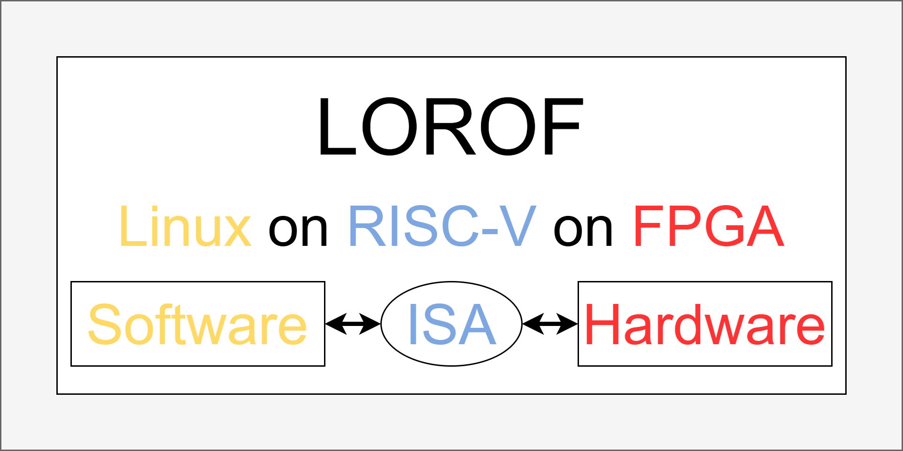

# LOROF
LOROF: Linux-on-RISCV-on-FPGA

The goal of the LOROF project is to architect, design, verify, and validate a RISC-V RV32IMAC_Zicsr_Zifencei Sv32 Quad-Core Superscalar Out-of-Order Virtual-Memory-Supporting CPU, successfully booting and running Linux on an FPGA. The project will include RTL designs, UVM based testbenches, C/C++ and RISC-V drivers, and comprehensive documentation.

## Architecture Basics
- for an intro to the computer architecture concepts involved in LOROF, check out [basics](./spec/design/basics/)

## Preliminary Specs
- for specs for RTL modules in the design, check out [modules](./spec/design/modules/)

## System

- see [system.md](./spec/design/modules/system/system.md) for more info

## Core

- see [core.md](./spec/design/modules/core/core.md) for more info
