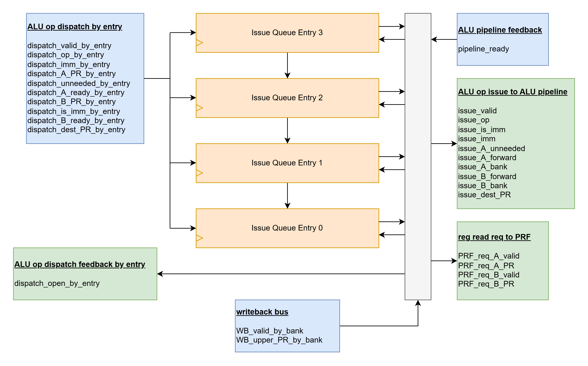

# alu_iq
- backend issue queue for ALU operations
- bandwidth of up to 1 ALU op issued per cycle
- up to 4 dispatched ALU ops accepted per cycle
- accepts dispatched ALU ops from Frontend, waiting for operands values to be ready or forwardable
- on a given cycle, the oldest ALU op with ready or forwardable operands is launched to the ALU pipeline if the pipeline is ready
- watches the writeback bus and uses dispatch info to determine when operands are ready or forwardable

## RTL Diagram

## Interfaces

### ALU op dispatch by entry
- dispatch_valid_by_entry
    - indicate that there is a new op dispatching from the Frontend for this issue queue to accept
    - indexed by IQ entry
    - IDLE VALUE: {1'b0, 1'b0, 1'b0, 1'b0}
- dispatch_op_by_entry
    - see [Supported Ops](#supported-ops)
    - indexed by IQ entry
    - IDLE VALUE: {4'bx, 4'bx, 4'bx, 4'bx}
- dispatch_imm_by_entry
    - immediate data value
    - indexed by IQ entry
    - IDLE VALUE: {32'hx, 32'hx, 32'hx, 32'hx}
- dispatch_A_PR_by_entry
    - indicate which physical register operand A uses
    - indexed by IQ entry 
    - IDLE VALUE: {6'hx, 6'hx, 6'hx, 6'hx}
- dispatch_A_unneeded_by_entry
    - indicate if op does not require operand A (and so does not need to wait for it to be ready)
    - indexed by IQ entry
    - IDLE VALUE: {1'bx, 1'bx, 1'bx, 1'bx}
- dispatch_A_ready_by_entry
    - indicate if operand A is ready for register read
    - indexed by IQ entry
    - IDLE VALUE: {1'bx, 1'bx, 1'bx, 1'bx}
- dispatch_B_PR_by_entry
    - indicate which physical register operand B uses
    - indexed by IQ entry
    - IDLE VALUE: {6'hx, 6'hx, 6'hx, 6'hx}
- dispatch_is_imm_by_entry
    - indicate if op should use the immediate data value for operand B (and so does not need to wait for the operand B register to be ready)
    - IDLE VALUE: {1'bx, 1'bx, 1'bx, 1'bx}
- dispatch_B_ready_by_entry
    - indicate if operand B is ready for register read
    - indexed by IQ entry
    - IDLE VALUE: {1'bx, 1'bx, 1'bx, 1'bx}
- dispatch_dest_PR_by_entry
    - indicate which physical register to writeback to
    - indexed by IQ entry
    - IDLE VALUE: {6'hx, 6'hx, 6'hx, 6'hx}

### ALU op dispatch feedback by entry
- dispatch_open_by_entry
    - indicate which issue queue entries are open for dispatch
    - indexed by IQ entry
    - RESET VALUE: 4'b1111

### ALU pipeline feedback
- pipeline_ready
    - indicate that pipeline is ready for a new op to be issued into it
    - IDLE VALUE: 1'b1

### writeback bus
- WB_valid_by_bank
    - indicate that writeback is being performed on the associated bank
    - IDLE VALUE: 4'b0000
- WB_upper_PR_by_bank
    - indicate the upper PR bits which writeback is being performed on by the associated bank
        - PR's are identified by 6 bits
        - there are 4 banks, and the 2 lowest bits of a PR indicate the bank it belongs to
        - a PR can be uniquely identified as being written back to by going to the bank it belongs to and checking waiting for the associated upper 4 bits to receive a writeback
    - IDLE VALUE: {4'x, 4'x, 4'x, 4'x}

### ALU op issue to ALU pipeline
- issue_valid
    - indicate that an op is being issued into the ALU pipeline
    - if issue_valid is low, the remaining signals in this "ALU op issue to ALU pipeline" interface are don't-cares. this implementation chooses the values from issue queue entry 0
    - RESET VALUE: 1'b0
- issue_op
    - see [Supported Ops](#supported-ops)
    - RESET VALUE: 4'b0000
- issue_is_imm
    - indicate if op should use the immediate data value for operand B
    - RESET VALUE: 1'b0
- issue_imm
    - immediate data value
    - RESET VALUE: 32'h0
- issue_A_unneeded
    - indicate if op does not require operand A (and so does not need to wait for it to be ready)
    - RESET VALUE: 1'b0
- issue_A_forward
    - indicate if operand A should take the forward data on the next cycle
    - RESET VALUE: 1'b0
- issue_A_bank
    - indicate which bank operand A should take its forward or reg data from
    - RESET VALUE: 2'h0
- issue_B_forward
    - indicate if operand B should take the forward data on the next cycle
    - RESET VALUE: 1'b0
- issue_B_bank
    - indicate which bank operand B should take its forward or reg data from
    - RESET VALUE: 2'h0
- issue_dest_PR
    - indicate which Physical Register to writeback to
    - RESET VALUE: 6'h0

### reg read req to PRF
- PRF_req_A_valid
    - indicate request to PRF to read operand A
    - RESET VALUE: 1'b0
- PRF_req_A_PR
    - operand A physical register
    - RESET VALUE: 6'h0
- PRF_req_B_valid
    - indicate request to PRF to read operand B
    - RESET VALUE: 1'b0
- PRF_req_B_PR
    - operand B physical register
    - RESET VALUE: 6'h0

## Issue Queue Entries
- Frontend dispatch is responsible for dispatching valid ops into this issue queue from the oldest/closest to 0 open/invalid entry first, as advertised by dispatch_open_by_entry
- This issue queue is responsible for maintaining a contiguous order of valid ops from oldest to youngest, starting from entry 0, whilst entries are issued out of the issue queue cycle by cycle, one at a time

## Example Operation
- 

## Supported Ops
- 4'b0000: Out = A + B
- 4'b0001: Out = A << B[4:0]
- 4'b0010: Out = signed(A) < signed(B)
- 4'b0011: Out = A < B
- 4'b0100: Out = A ^ B
- 4'b0101: Out = A >> B[4:0]
- 4'b0110: Out = A | B
- 4'b0111: Out = A & B
- 4'b1000: Out = A - B
- 4'b1101: Out = signed(A) >>> B[4:0]
- 4'b1111: Out = B

## Targeted Instructions
- LUI
    - op_in = 4'b1111
    - A_unneeded_in = 1
    - is_imm_in = 1
- ADDI
    - op_in = 4'b0000
    - is_imm_in = 1
- SLTI
    - op_in = 4'b0010
    - is_imm_in = 1
- SLTIU
    - op_in = 4'b0011
    - is_imm_in = 1
- XORI
    - op_in = 4'b0100
    - is_imm_in = 1
- ORI
    - op_in = 4'b0110
    - is_imm_in = 1
- ANDI
    - op_in = 4'b0111
    - is_imm_in = 1
- SLLI
    - op_in = 4'b0001
    - is_imm_in = 1
- SRLI
    - op_in = 4'b0101
    - is_imm_in = 1
- SRAI
    - op_in = 4'b1101
    - is_imm_in = 1
- ADD
    - op_in = 4'b0000
- SUB
    - op_in = 4'b1000
- SLL
    - op_in = 4'b0001
- SLT
    - op_in = 4'b0010
- SLTU
    - op_in = 4'b0011
- XOR
    - op_in = 4'b0100
- SRL
    - op_in = 4'b0101
- SRA
    - op_in = 4'b1101
- OR
    - op_in = 4'b0110
- AND
    - op_in = 4'b0111
