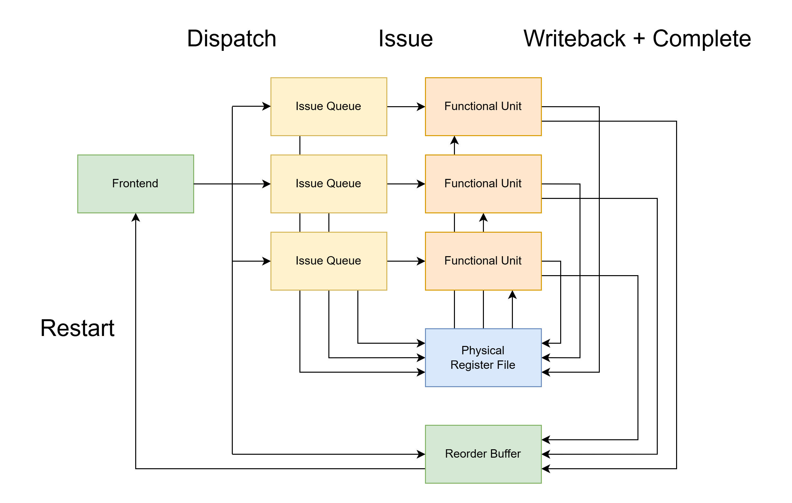
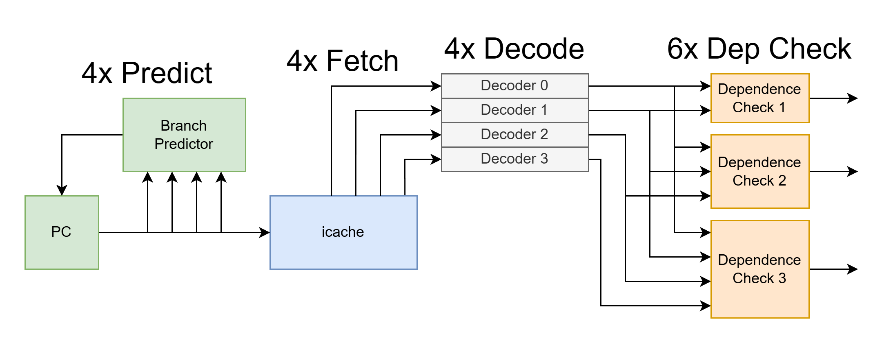

# Core Basics
The LOROF CPU cores are moderately sophisticated superscalar out-of-order engines which are in the ideal case capable of 4 IPC. 

### Out-of-Order Execution Hides Latencies
- out-of-order execution allows for the core to work on independent instructions while waiting for high-latency instructions (notably loads) to complete
- a simple in-order pipeline with a load in mem stage waiting on a dcache miss would have to stall all the instructions behind it until the dcache is filled. this is awful for instruction throughput
- an out-of-order pipeline can complete independent arithmetic, branch, store, etc. instructions while the load miss is being processed, or even get dcache hits and create more dcache misses from other load instructions

### Superscalar Execution Increases IPC
- a simple in-order scalar pipeline only fetches, decodes, executes, etc. one instruction per cycle. this massively limits the instruction bandwidth of a core, especially as critical paths and pipeline depths can no longer be optimized
- a superscalar pipeline can fetch, decode, execute, etc. more than one instruction per cycle, effectively breaching the 1 IPC limitation
- superscalar is an orthogonal design choice to out-of-order, but the two work very well together to create high-performance CPU cores. a superscalar frontends can fetch many independent instructions that can be completed out-of-order while high-latency instructions are stalled

# Out-of-Order Basics

An R10K-style out-of-order core contains these fundamental components:

## Frontend (FE)
- fetch, decode, rename, and dispatch instructions in-order into their respective issue queues and the reorder buffer
- see [reg_rename_basics.md](reg_rename_basics.md) for more info

## Backend (BE)
- made up of issue queues, functional units, and the physical register file
- simply responsible for executing decoded instructions
- the structures in the frontend (notably register rename) allow the backend to execute out-of-order

### Issue Queues (IQ's)
- buffer instructions until their operands are ready and the associated pipeline is ready for issue, which can happen out-of-order
- issue queues hold the state of dispatched instructions, waiting for the instruction's operands to be ready, so that they can be subsequently issued to the associated FU pipeline
- see [iq_basics.md](iq_basics.md) for more info

### Functional Units (FU's)
- execute instructions
    - perform the actual 32-bit add for an ADD instruction
    - load a word from memory for a LW instruction
    - determine if there is a misprediction on a BEQ instruction
- each functional unit is generally specialized to a subset of related instructions
- in LOROF, the functional units cover mutually exclusive sets of instructions
    - ALU reg-reg pipeline
    - ALU reg-imm pipeline
    - branch pipeline
    - load pipeline
    - store pipeline
    - AMO pipeline
    - multiplication/division pipeline
    - system/CSR pipeline

### Physical Register File (PRF)
- register file utilizing physical registers, which are a superset of the e.g. 32x architectural registers defined in the ISA
- architectural registers are renamed to physical registers in the frontend so that the functional units can freely read and write register values out-of-order, without worrying about WAR and WAW register hazards
    - RAW register hazards are still a true hazard, and can make up a high-latency chain of operations in a bad case. The purpose of out of order is to be able to do useful work at the same time that these high-latency operation chains are resolved. 
- physical registers can contain speculated data
    - e.g. an ADD instruction right after a BEQ instruction can write to its destination physical register freely when it completes, but if it is found that the branch is mispredicted, this data can be ignored via register rename
- see [reg_rename_basics.md](reg_rename_basics.md) for more info

## Reorder Buffer (ROB)
- clean up state from out-of-order execution to make things look like they completed correctly, in-order 
- dispatched instructions are enqueued into the ROB in-order
    - get information to be able to restart the instruction or raise an exception
        - PC, architectural register writing to, physical register writing to, old physical register mapping
- instructions are marked as complete out-of-order as they are executed in the FU's
- completed instructions are dequeued from the ROB in-order when an instruction is the oldest instruction in the ROB and it is complete
    - old physical registers are freed
    - exceptions or restarts are handled
        - younger speculated instructions are killed so they can't modify architectural state
        - the frontend's state is restored as if the excepting or restarting instruction had just started or just finished (whichever is desired)
        - if a BEQ was mispredicted, the frontend would restart at the correct branch target
            - here, the frontend would be made to look like the BEQ had just finished
        - if a LW got a page fault, the ROB would restart the frontend in supervisor mode (OS control) at the page fault exception handler
            - here, the frontend would be made to look like the LW had just started

# Superscalar Basics

A superscalar core increases the frontend instruction width. The backend appropriately increases its bandwidth via multiple FU's to support this wider frontend

- an n-way superscalar design has an n-wide frontend: it fetches, decodes, renames, and dispatches n instructions per cycle
    - because of this, the frontend must increase the bandwidth to the branch predictor, icache, decoders, rename structures, and take care of some dependency checking when it performs renames
        - branch predictors need to check for n potential branches
        - fetch can be widened via swizzling instructions from multiple wide icache blocks
        - decoders are simply duplicated n times
        - rename structures must be able to rename and provide operand renames for n different instructions
        - dependence checks are needed to see if a younger instruction uses an operand produced by an older instruction in the same superscalar group
            - register renaming must take this into account
            - this is similar to forwarding networks, which also grow in O(n^2), which is especially relevant in superscalar designs with many backend pipelines or writeback buses
            - dependence checking growth
                - scalar: no dependence checking
                - 2-way superscalar: 1x dependence check
                - 3-way superscalar: 3x dependence checks
                - 4-way superscalar: 6x dependence checks
                - 5-way superscalar: 10x dependence checks
                - 6-way superscalar: 15x dependence checks
                - 7-way superscalar: 21x dependence checks
                - 8-way superscalar: 28x dependence checks
    - supporting bandwidth increases can range in complexity increasing at a rate O(n) to O(n^2)
        - following the diagram above, a 4-way superscalar frontend grows icache branch predictor, icache, and decoder bandwidth at O(n), but dependence checking grows at O(n^2)
- the backend of the pipeline must also be wide in order to issue multiple instructions per cycle to support these n instructions per cycle by the frontend 
    - the backend can be completely decoupled and follow a completely unrelated instruction bandwidth different from the n-way superscalar frontend
    - a multiple-issue backend means execution hardware must be available to execute multiple instructions simultaneously
        - multiple ALU's, independent pipelines, multi-ported dcache, etc.
    - notably, this means a massive increase in demand on the register file
        - LOROF uses a 4x bank, 2x read port + 1x write port per-bank register file
    - again, supporting bandwidth increases can range in complexity increasing at a rate O(n) to O(n^2)
- LOROF uses a 4-way superscalar frontend and a backend with a 1 IPC bandwidth per pipeline
    - these are both for the maximum-bandwidth case
    - typical behavior will be closer to 3 IPC for the frontend due to branches, and much lower with icache misses
    - typical behavior will be much lower than 1 IPC for the backend FU's due to various data and structural hazards and bursty use of the different FU's following the distribution of instructions among the FU's
        - essentially, the backend should be able to handle moderately bad case FU distributions from the frontend
            - e.g. the backend shouldn't stall much just because there are 4x loads dispatched in a row
        - also, the backend will never be permanently fully busy as its theoretical 8 IPC cannot be sustained by a 4 IPC frontend
            - this fundamental difference is why hardware multithreading can make sense, as 2 or more frontends can more appropriately feed the full bandwidth potential of a powerful backend