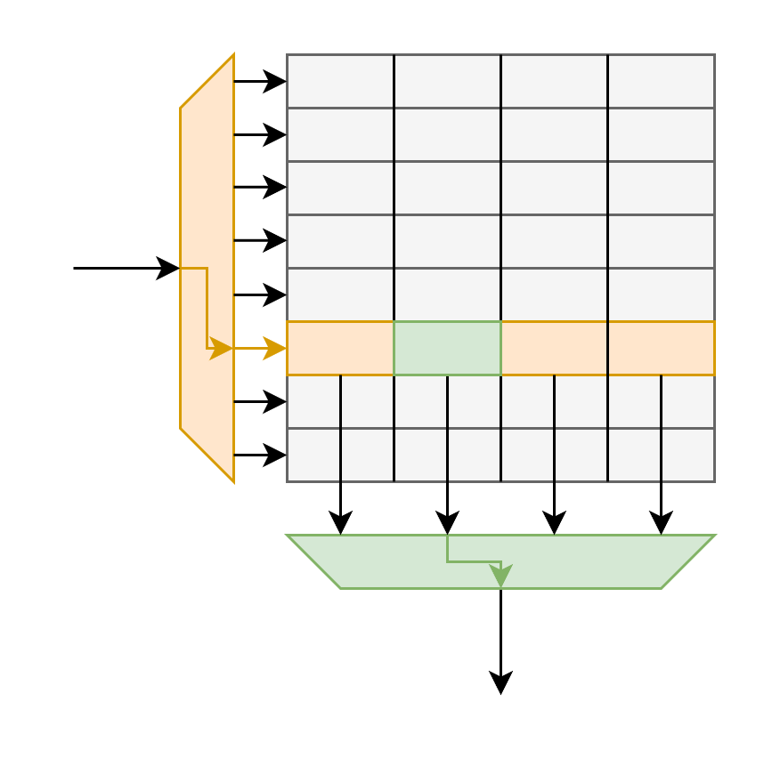
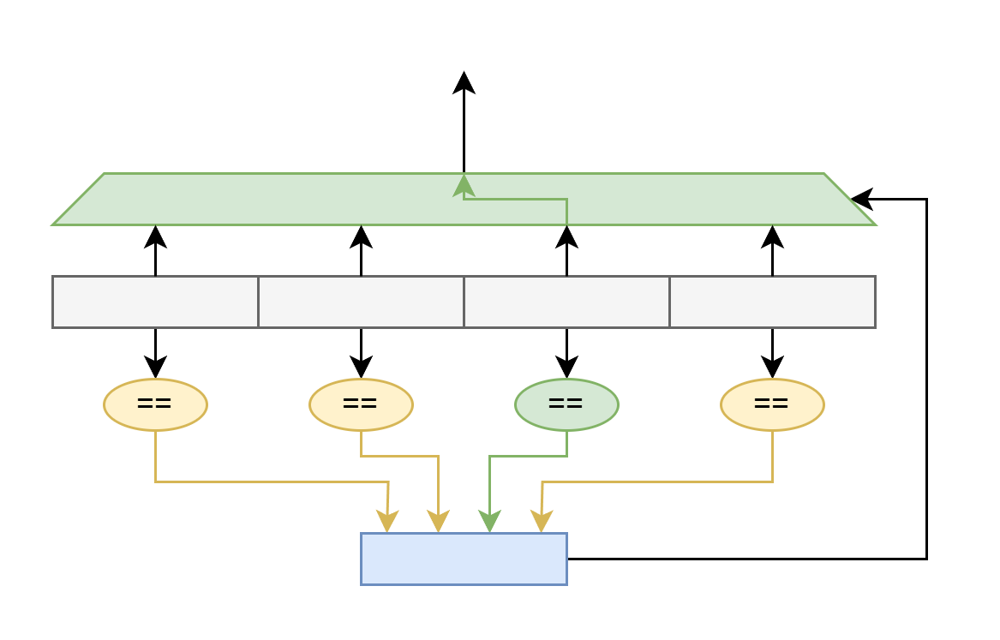
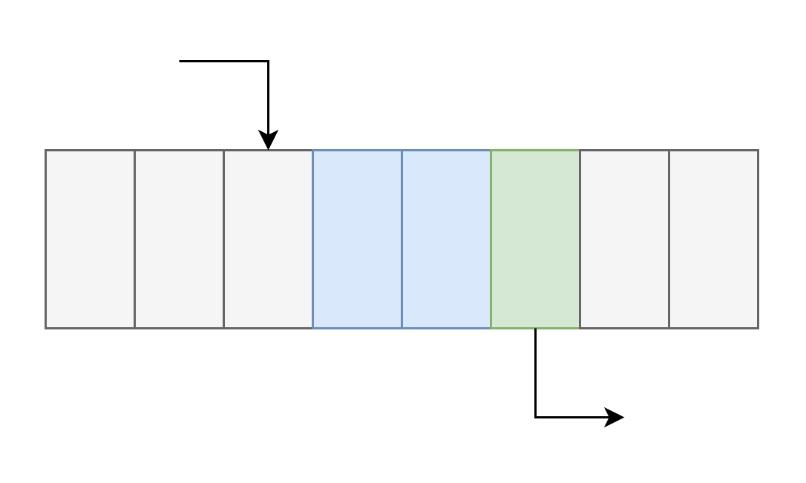
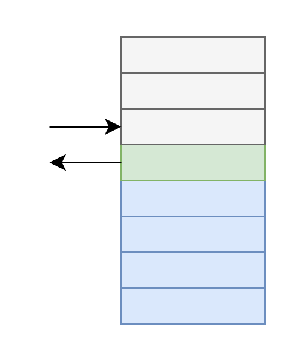
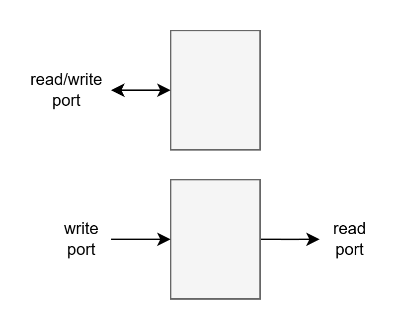
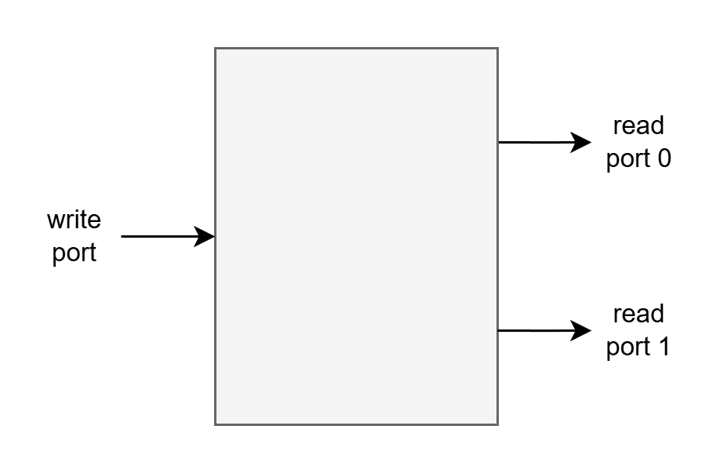
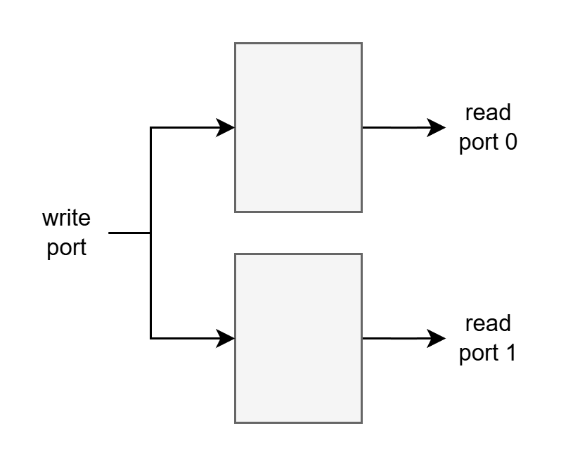
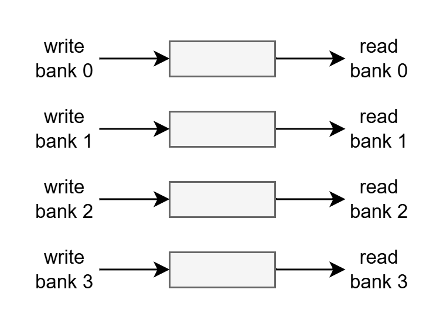

# Memory Arrays
Memory arrays are used to minimize the area taken up by regularly organized and accessed data structures. Essentially, it would be highly inefficient to implement all of the memory state in a CPU using flip flops (although this would be functionally possible as flip flops are the most flexible memory). Memory arrays are inherently wire-limited in order to minimize area, which inherently means there are limits to their access bandwidth. 

# Classes of Memories
Below are some classes of memories that are useful for processor design:

### RAM

- Random Access Memory
- RAMs essentially implement indexed tables of memory
- RAMs are read via one or more read ports which read the value at a given read index
- RAMs are written via one or more write ports which write a given value at a given write index
    - a single read/write port is also possible as in e.g. 6T SRAM

### CAM

- Content Addressable Memory
- given a search key, a CAM returns any entries in the memory which match the search key
- CAMs are useful for associative data arrays which need tag checks, or dependence checking of e.g. loads on stores to a matching address
- CAMs are read in parallel (with potentially a layer of indexing before this to select out which set of values should be read in parallel)
- CAMs are usually written to using a single write index at a time

### FIFO

- First-In, First-Out
- in-order queue/buffer/FIFO
- FIFOs can be modeled as a RAM with a simple incrementing read index and a simple incrementing write index
    - enqueue operation: add element to FIFO
        - write value at write index
        - increment write index
    - dequeue operation: remove element from FIFO
        - read value at read index
        - increment read index

### LIFO

- Last-In, First-Out
- AKA stack
- LIFOs can be modeled as a RAM with a single simple incrementing or decrementing read/write index/TOS (Top-Of-Stack)
    - push operation: add element to LIFO
        - increment TOS
        - write value at TOS
    - pop operation: remove element from LIFO
        - read value at TOS
        - decrement TOS
    - a LIFO might allow simultaneous push and pop operations
        - much less trivial to support than FIFO simultaneous enqueue and dequeue

# RAM Tricks
Due to the greatly limited functionality constraints of RAM technologies, most notably access bandwidth constraints, tricks must be played to increase RAM bandwidth. Some of these tricks are composable with other tricks.
- the LOROF prf uses replication and banking

### Ports

A port is a fully-independent (or independent enough--there can be disallowing of ports having the same index at a given time) read and/or write index into a RAM array. RAM technologies typically only natively support a single read/write port, or 1 read port and 1 write port. This is a massive limiter to access bandwidth.

### Multi-Porting

Custom RAMs can implement additional independent ports. SRAM technology can implement multi-porting, albeit with O(n^2) growing area and power cost in adding ports. 

### Replication

RAM arrays can be replicated to increase read ports at O(n) growing area and power cost. Each replicate of the array has an independent read port, and the write ports of each array is used to perform a single write at a time to all replicates. 

### Banking

A large memory array can be split up into banks, which are mutually-exclusive subsets of the entries in the larger merged, logical array. Each bank can then be implemented as its own RAM, therefore increasing the read AND write ports, as long as there are no bank conflicts. 

Just as there would be conflicts if a regular RAM had more read and/or write requests than read and/or write ports, bank conflicts occur when there are more read and/or write requests than read and/or write ports for the bank. In the case of a conflict, the requests must be stalled and serviced serially, limiting the potential bandwidth. A banked implementation of a RAM array can approach a bankwise multiplication in access bandwidth if bank conflicts are minimized. Bank conflict minimization simply relies on a good distribution of accesses among banks. With a good, naturally-uniformly-accessed RAM array, this can be as simple as assigning banks following bits in the access index. 

Banking has a roughly O(n) increase in area and power, but with a large coefficient c*n as conflict detection and arbitration logic must be replicated per bank. There can also be significant area and power consequences due to routing port requests to multiple banks instead of a single array.

### Other Tricks for Bandwidth or Improved Parallelism
- striping, interleaving
- row hits
- channels
- many more

# ASIC Memory Options
ASIC allows for full-custom design of circuits. Below is a list of some of the memory options available on a logic process technology (i.e. not memory chips like DRAM and NAND flash):

### Flip Flop Arrays
Simply use standard cell library or custom flip flops to create memories. Flip flops can implement any memory class, albeit highly inefficiently as there is no optimization for the memory organization or access pattern. 

### SRAM Arrays
Static Random Access Memory (SRAM) cells are dense (at least as far as logic processes go) static circuits which allow word-granularity reads and writes. SRAM is used for all the table memories in modern CPUs: register files, register rename structures, ROBs, caches, large buffers.

### CAM Arrays
CAMs can be implemented as custom ASIC arrays -- i.e. not implemented with typical standard cell libraries. These custom CAM implementations can be much better optimized for power, access bandwidth, capacity, and area. One of the stars of modern out-of-order processors are the Load-Store Queue CAM arrays. 

# FPGA Memory Options
FPGAs notably do not have access to technologies that efficiently implement CAMs. 

### Flip Flop Arrays
Flip flops can implement any memory class, albeit highly inefficiently as there is no optimization for the memory organization or access pattern. Unfortunately, CAMs must be implemented as flip flop arrays when targetting FPGA technology.

### Distributed RAM Arrays
Xilinx FPGAs (as used by LOROF) have Distributed RAM, which is essentially a repurposing of the FPGA LUTs as 1 read port, 1 write port RAM. Distributed RAM is lower LUT cost and power than a simple, unoptimized, 1 or 2 read port, 1 write port, 2D flip flop array. 

### BRAM Arrays
Xilinx and Intel FPGAs have dedicated Block RAMs separate from the LUT array structure. These generally have 1- or 2-cycle-delayed clocked reads from a single read index and clocked writes from a single write index (or a single clocked read/write index). For LOROF, BRAMs are most obviously used for the mid- to low-bandwidth demand, high-capacity demand, and simple access pattern tables: the branch prediction tables, ROB, and caches.
