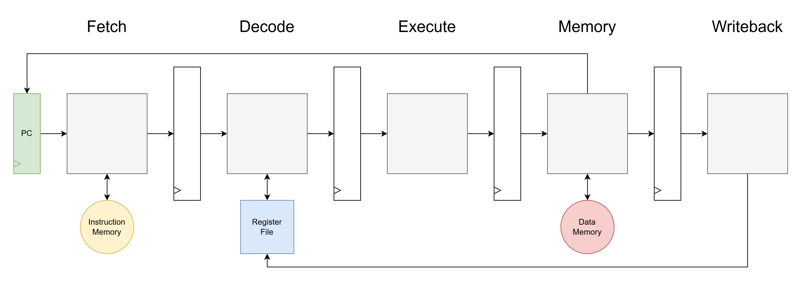

# Precise State Basics
- see [core_basics.md](core_basics.md) for out-of-order core basics first
- see [reg_rename_basics.md](reg_rename_basics.md) for register rename concepts first

The architectural state is defined by an ISA, and generally describes the state that the program is in at a given instruction. A machine can maintain precise state if the architectural state of any instruction can be restored as needed. 

Architectural state in RISC-V includes:
- PC
- register file
- CSR's
- memory

Sophisticated superscalar out-of-order machines use many hardware mechanisms different than the direct forms of state as described by the ISA's architectural state in order to optimize for performance. If these sophisticated machines wish to ensure precise state, they must design these hardware mechanisms accordingly. 
- a simple example of a non-ISA-defined hardware mechanism is a writeback cache. Main memory isn't directly updated with a value that is written to memory by a store instruction, instead opting to buffer the value in a dirty cache block for now. However, the program will appear as if this value is coming from memory when the value is read again, say by a later load instruction, as the value will be correctly grabbed from the dirty cache block instead of memory. As such, a cache bypasses the ISA-defined idea of memory in order to make memory accesses more performant.

Maintaining precise state is necessary to support instruction restarts and exceptions.
- if a branch mispredicts and execution must restart from a different instruction than predicted, the precise state right after the branch must be restored and continued from
- if a load instruction gets a page fault, the precise state before the load instruction must be restored before raising the exception

In general, precise state is violated when a speculated instruction makes modifications to the architectural state, and these modifications are not undone if it is found that the instruction should not be completed. 

The following is a description of how hard the specific components of architectural state are to reverse once they have been speculatively modified:
- PC
    - <ins>easy</ins>
    - as long as the PC of the instruction of interest is saved, it can be easily restored into the PC register
- register file
    - <ins>hard</ins>
    - if you want to speculatively write to the register file, you need hardware structures to keep track of what are the official architectural register values and what are speculative register values
    - out-of-order processors pay this cost in order to take advantage of more instruction-level parallelism
    - see [reg_rename_basics.md](reg_rename_basics.md)
- CSR's
    - <ins>hard</ins>
    - similar issues as register file. CSR's can additionally modify crucial execution behaviors like the current privilege mode, so there is additional sensitivity to how these are handled with respect to precise state 
    - CSR accesses are a tiny part of programs, so Amdahl's law suggests that much less effort ought to be used to enable speculation on CSR's
- memory
    - <ins>practically impossible</ins>
    - if a speculative memory write enters the memory system, other cores, IO devices, or sensitive memory spaces can see the effects of the write--and the write might not even be part of the program!
    - remember, we are only concerned with speculative state <ins>modification</ins>. instruction reads and data loads are non-destructive, in that they don't modify the state of memory, so they can be freely speculatively completed with no concern about speculative state
        - there can be performance concerns with mis-speculated memory reads causing unwanted cache fills, bus transactions, or DRAM accesses. but there won't be any correctness concerns

# Scalar In-Order Pipeline Precise State

A simple scalar in-order pipeline is very specifically designed to naturally maintain precise state. 

A typical implementation resolves branches and exceptions at the latest in Memory stage, and can flush instructions in the Fetch, Decode, and Execute stages. This means that instructions can be speculatively executed in Fetch, Decode, and Execute stages. This is perfectly fine, as all of the architectural state in the Fetch, Decode, and Execute stages are either easily recoverable (PC) or don't modify the architectural state (instruction memory reads and register file reads). All of the unrecoverable architectural state modification happens in the Memory stage (data memroy reads and writes) and Writeback stage (register file writes), where instructions are committed, no longer speculative, and should definitely be executed. 

# R10K Out-of-Order Precise State

Out-of-order processors seek to execute instructions out-of-order in order to take advantage of instruction-level parallelism. However, precise state must be maintained by ensuring the instructions are completed correctly, as if they were in-order, and they observe the correct restarts and exceptions. As such, a reordering is necessary.

Out-of-order processors maintain precise state using the idea of <ins>committing</ins>, which is when the architectural state modifications designated by an instruction are irreversibly performed. Commit must be done in-order, but instruction <ins>execution/completion</ins> can be done freely, out-of-order. This combination of in-order commit and out-of-order execute/complete allows for precise state correctness to be maintained, while allowing for performance optimizations. 

## Reorder Buffer (ROB)

The ROB is the central FIFO structure responsible for ensuring speculated instructions are either killed if they are mis-speculated, or their results are committed to the architectural state in-order if they are supposed to be completed for the program. 

In R10K register renaming, the precise state modifications to the PC and register file are stored in the ROB in the form of the PC value of the instruction and the Map Table modification. Instructions are enqueued onto the ROB upon dispatch with their PC, and if applicable, the architectural register they are writing to, the old physical register mapping, and the new physical register mapping. 

Instructions freely execute out-of-order, and when they complete, they send a complete notification or restart/exception request to the ROB targetting this instruction's ROB entry. 

The ROB dequeues from its head in-order, either committing non-speculated, correct instructions, or rolling back the effects of killed, restarting, or excepting incorrect instructions. When the oldest instruction in the ROB (the ROB entry at the head of the ROB FIFO) is complete, the ROB checks for a regular commit vs. rollback (killed, restarting, or excepting) to determine its actions for the instruction:
- commit steps:
    - free the old physical register
    - make memory and CSR architectural state modifications
        - if store or AMO instruction: write to memory
        - if CSR instruction: perform CSR write
            - LOROF takes this approach
            - it is also possible for CSR's to have their own speculative write rules and rollback mechanisms similar to the register file
- rollback steps:
    - revert the mapping of the writing architectural register to the old physical register mapping in the Map Table
    - free the new physical register
    - revert the PC
    - don't make any memory or CSR architectural modifications

## Early Restart

The ROB enables precise state maintainence by holding the information necessary to roll back the Map Table. However, for most implementations: 1) the ROB has to serially rollback precise state modifications to restore precise state AND/OR 2) an instruction must wait until it is the oldest in the ROB before it can request a roll back to a previous architectural state. Both of these are massive performance concerns. Prediction is only so effective, and instruction restarts are moderately common (every branch misprediction), so this process ideally would be sped up or bypassed. 

One option is to create a checkpoint of sorts from the Map Table state which can be used to quickly restore the Map Table to the previous state upon a restart or exception. 
- LOROF utilizes a simple and effective checkpointing strategy: make a copy of the Map Table when there is an instruction which is likely to mispredict, and keep that copy around until the instruction is committed in case the instruction's precise state needs to be restored. 

# Notes

In other out-of-order paradigms different than the R10K-style out-of-order, a ROB is still used, but the ROB stores different information based on how the register rename structures enable out-of-order execution and how they need to be rolled back. 