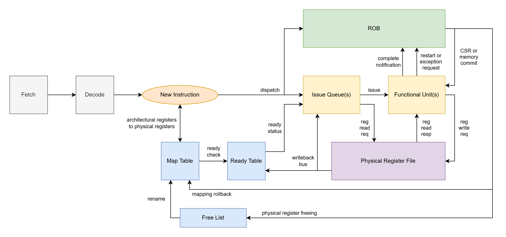

# Register Rename Basics
- see [core_basics.md](core_basics.md) for out-of-order core basics first
- see [precise_state_basics.md](precise_state_basics.md) for more on how execution can be out-of-order but still follow in-order program semantics

Register renaming is a strategy used by out-of-order processors to remove register WAR and WAW hazards so that independent instructions can complete out-of-order. The true dependence, RAW, cannot be avoided and must be maintained. 

## The Problem

Consider the following program:
```
ADD     r1, r2, r3
SW      r1, 0(r4)
ADDI    r4, r4, 4
SUB     r1, r2, r3
ANDI    r5, r1, 1
```
Let's look at all of the register hazards:
- the SW reads r1 after the ADD writes r1 -> RAW
- the ADDI writes r4 after the SW reads r4 -> WAR
- the SUB writes r1 after the SW reads r1 -> WAR
- the SUB writes r1 after the ADD writes r1 -> WAW
- the ANDI reads r1 after the SUB writes r1 -> RAW

The only true RAW dependences are the ADD before the SW and the SUB before the ANDI. Theoretically, besides these two RAW dependences, there are no other ordering constraints on when the instructions can complete as there are no other chains of data dependence. The clearest example are the ADD and SUB instructions. r2 and r3 are both register values that are ready to be read at any time. The ADD and SUB therefore have the operands they need to complete their arithmetic operation, so they should be allowed to complete in either order or at the same time. However, WAR and WAW hazards prevent this.

The ADDI should be allowed to complete before the SW as the ADDI is creating a new value for r4 which is distinct from the old value that the SW needs. However, if the ADDI completed first, then the SW would read the new value in r4 written to the register file by the ADDI instead of the old value before the ADDI. 

The SUB should be allowed to complete before the ADD as the SUB is creating a new value for r1 which is distinct from the old value created by the ADD. However, if the SUB completed first, then the ADD would write its old value to r1 in the register file after, and then the final value of r1 would be the incorrect value from the ADD. Then, if the ANDI were to complete after this, it would read the incorrect value for r1 written by the ADD.

We can get rid of these WAR and WAW ordering constraints using register renaming. 

## Using Register Renaming
Register renaming utilizes additional hardware to track the version of register values, and provide newer vs. older instructions with the correct version of the register value that the instruction should use. This removes WAR and WAW hazards by giving older instructions the older value before the write, and newer instructions the newer value after the write. RAW hazards are maintained by forcing instructions to wait for their version of the register value to be written before it can be read. 

The registers in the machine code ISA are the architectural registers. These architectural registers don't have to be implemented in hardware strictly as the ISA describes. e.g. for 32-bit RISC-V, hardware doesn't strictly have to use a 32x32 register file. Architectural registers can be dynamically renamed to different physical registers as new register value versions are created. 

## Register Rename Actions
Every time an architectural register is written to by an instruction, a new physical register is allocated, which will get the result of the instruction. 

The program can be renamed as follows:
```
# starting with r1 = p1, r2 = p2, r3 = p3, r4 = p4, r5 = p5

ADD     r1, r2, r3  ->  p6, p2, p3  < r1 renamed to p6
SW      r1, 0(r4)   ->  p6, 0(p4)   
ADDI    r4, r4, 4   ->  p7, p4, 4   < r4 renamed to p7
SUB     r1, r2, r3  ->  p8, p2, p3  < r1 renamed to p8
ANDI    r5, r1, 1   ->  p9, p8, 1   < r5 renamed to p9
```
Let's look at all of the register hazards:
- the SW reads p6 after the ADD writes p6 -> RAW
- the ANDI reads p8 after the SUB writes p8 -> RAW

The only remaining hazards are now RAW hazards -> WAR and WAW hazards have been eliminated!
- the ADD and SUB can complete at any time as their operands p2 and p3 are not being written by any instruction
- the ADDI can complete at any time as its operand physical register p4 is not being written by any instruction

Thus, register renaming has opened more opportunities for instructions to be completed out-of-order.

# R10K Register Rename Hardware

LOROF uses R10K-style register rename (one of a couple methods), which does a "true" register rename, essentially matching what was visualized above. Architectural registers encoded in the instructions are mapped to physical registers in-order in the frontend, and then instructions can complete out-of-order in the backend using physical register operands from the physical register file. Renaming is achieved using the following hardware structures: a map table, a free list, a ready table, and a physical register file. 



## Map Table
The Map Table is a lookup table in the frontend which provides the current mapping of architectural registers to physical registers. 

The Map Table is updated whenever an instruction writes to a register. The mapping for the architectural register being written to will be updated to the new free physical register.

Refer again to the renaming code example:
```
# starting with r1 = p1, r2 = p2, r3 = p3, r4 = p4, r5 = p5

ADD     r1, r2, r3  ->  p6, p2, p3  < r1 renamed to p6
SW      r1, 0(r4)   ->  p6, 0(p4)   
ADDI    r4, r4, 4   ->  p7, p4, 4   < r4 renamed to p7
SUB     r1, r2, r3  ->  p8, p2, p3  < r1 renamed to p8
ANDI    r5, r1, 1   ->  p9, p8, 1   < r5 renamed to p9
```

The Map Table state updates for each instruction:
```
r1: p1 -> p6 (ADD) -> p8 (SUB)
r2: p2
r3: p3
r4: p4 -> p7 (ADDI)
r5: p5 -> p9 (ANDI)
```
The SW instruction does not perform a write to a register, so it does not perform any renames.

Updates to the Map Table must be performed in program order, otherwise the incorrect register versions will be given to instructions, leading to incorrect program results.
- this in-order requirement is what must be checked for by the dependence checking logic as described in the superscalar discussion in [core_basics.md: Superscalar Basics](core_basics.md#superscalar-basics)

## Free List
The Free List is a FIFO in the frontend which contains a list of physical registers which are not assigned to an active register version, and are therefore free to be assigned to a new register version. 

Free registers are dequeued from the free list when a register rename is performed. 
- in the program example, the ADD dequeues p6 for rename, the ADDI dequeues p7 for rename, the SUB dequeues p8 for rename, and the ANDI dequeues p9 for rename

Free registers are enqueued back onto the free list when the lifetime of the physical register has ended. This can happen when:
- an instruction is committed to the architectural state: the old physical register mapping can be freed
    - in the program example, the ADD frees p1, the ADDI frees p4, the SUB frees p6, and the ANDI frees p5
    - when the ADD is committed to the architectural state (when it is the oldest instruction, it is complete, and it is expected to execute), since r1 was renamed from p1 to p6, it can be guaranteed that no other instruction will need p1 as this is the oldest instruction. Therefore, any younger instruction will only want the version of r1 in p6, so the version in p1 is no longer needed, so p1 can be freed
- a speculated instruction's state is disposed of: the new physical register mapping can be freed
    - in the program example, if this stream of instructions were preceded by a branch which ended up being mispredicted, then the ADD frees p6, the ADDI frees p7, the SUB frees p8, and the ANDI frees p9

If the free list is empty, the frontend must be stalled. 

## Ready Table
The Ready Table is a simple bit-vector in the frontend which indicates whether a physical register is ready. This is necessary to enforce RAW hazards, this way a register version is never attempted to be read until the write of that version has occurred. 

When there is a new rename, the ready table bit for the associated physical register is cleared. 

When the instruction writing the physical register completes, it sets the associated bit for the physical register in the Ready Table. 

The ready table is generally placed in the in-order frontend, where an initial "ready" vs "not ready" is read for each physical register operand. But an instruction in an issue queue after the ready table must be updated when a physical register version of interest becomes ready. Instruction completions notifications are not only given to the Ready Table, but also to the issue queues to say what new physical registers are ready on a given cycle. This is the purpose of the Writeback Buses connected to the issue queues. 

## Physical Register File
The Physical Register File is the memory array of physical registers. The physical register file can be scaled much larger than the architectural register file in order to support a larger set of register-writing instructions in the instruction window, and therefore more potential for instruction-level parallelism. 

For LOROF, a 128x32 register file is used in order to allow for up to 128 different register versions to be active in the core. 

# Notes

R10K-style register rename is just one way to implement register renaming in out-of-order processors. it is however the most ubiquitous, effective, and scalable solution. 

Another notable method utilizes entries in the ROB to buffer speculated register file writes. Register writes are not officially performed on the register file until the instruction is committed from the head of the ROB. Instructions read a map table which tells the instruction whether to get an instruction value from the register file or the speculated ROB buffer of register values. 

Another notable method utilizes a future file, allowing all speculated instructions to write to this future file, but still buffering updates to the architectural register file which can be referred back to when the future file is invalidated upon mis-speculation. 
