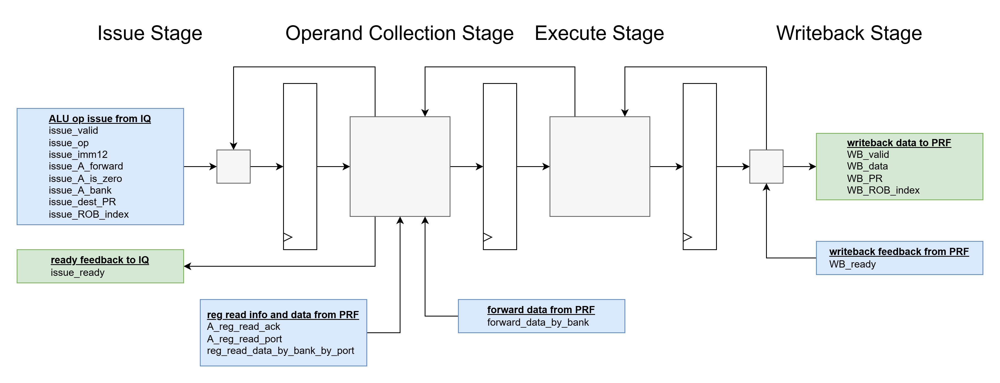

# alu_imm_pipeline
- backend functional unit for ALU register-immediate operations
    - R[dest] <= R[A] op imm
        - see [Targeted Instructions](#targeted-instructions)
    - see [core_basics.md](../../basics/core_basics.md) for the basic purpose of a functional unit in the backend of the core
- example operation: [alu_imm_pipeline_example.md](alu_imm_pipeline_example.md)
- receives issued ALU imm operations, collects the register operand data value, performs the ALU operation, and writes the data back to the PRF
- pipelined with issue, operand collection, execute, and writeback stages
- bandwidth of up to 1 ALU op executed per cycle
    - maintained as long as:
        - operands are immediately gathered on the first cycle in OC stage. see [Operand Collection (OC) Stage](#operand-collection-oc-stage)
        - the PRF is always ready for writeback
        - new ALU ops continue to be issued
- utilizes alu module. see [alu.md](../alu/alu.md)
- operands can be collected through PRF register read responses or forwarded data
    - PRF register read requests were previously initiated by the issue queue. the pipeline's job is to simply collect the register values when they arrive
- operand A is needed for all ops in this pipeline
- the term "op" will be used throughout this spec to describe the unique valid collection of data that flows through the pipeline, inhabiting a single pipeline stage a time, starting from a cycle where issue_valid = 1'b1 and issue_ready = 1'b0. this term "op" is analagous to a unique instruction flowing through a classic in-order 5-stage CPU pipeline

# RTL Diagram

# Parameters

## Variable Parameters
- none

## Constant Parameters
All of these are constants from core_types_pkg.vh
- LOG_PR_COUNT = 7
- LOG_ROB_ENTRIES = 7
- PRF_BANK_COUNT = 4
- LOG_PRF_BANK_COUNT = 2

# Interfaces
Inputs interfaces blue. Output interfaces green.
These signals make more sense in combination with the information in the [Pipeline Stages](#pipeline-stages) section.

## seq

This is a sequential module utilizing posedge flip flops

- CLK
    - input logic
    - clock signal
- nRST
    - input logic
    - active-low asynchronous reset
    - the entire module state can be reset after a single asynchronous assertion

## ALU imm op issue from IQ

input interface

- issue_valid
    - input logic
    - indicate that an ALU imm op is being issued this cycle
        - or is at least being attempted
    - a valid issue is ignored if issue_ready = 1'b0
        - i.e. the OC stage will stall with its current op instead of accepting the new issue op
    - constraints:
        - utilize as control signal to indicate an issue attempt
    - idle value:
        - 1'b0
- issue_op
    - input logic [3:0]
    - 4-bit op to apply on operands A and imm to create the WB data value
    - this directly translates to the ops used by the alu module. see [alu.md](../alu/alu.md)
    - constraints:
        - none
    - idle value:
        - 4'hx
- issue_imm12
    - input logic [11:0]
    - 12-bit immediate which will be sign extended to 32-bits and used as the second operand in the ALU operation
    - constraints:
        - none
    - idle value:
        - 12'hx
- issue_A_forward
    - input logic
    - == 1'b1:
        - indicate that operand A's data should be collected from the forward data bus on the next cycle when the op is in the OC stage
        - when the op enters OC stage, it utilizes the issue_A_bank signal to select which forward data bus bank to select from
    - == 1'b0:
        - indicate that operand A's data should be collected from a reg read from the PRF when the op is in the OC stage
            - this data can come at the cycle the op first enters OC stage or any cycle after
        - when the op enters OC stage, it utilizes the A_reg_read_ack to know that its reg read data is available, and utilizes A_reg_read_port and previous issue_A_bank to select the data of interest from reg_read_data_by_bank_by_port
    - constraints:
        none
    - idle value:
        - 1'bx
- issue_A_bank
    - input logic [1:0]
        - design uses: input logic [LOG_PRF_BANK_COUNT-1:0]
    - indicate which bank {0, 1, 2, 3} to be used for operand A when collecting data in the OC stage
    - constraints:
        - none
    - idle value:
        - 1'bx
- issue_dest_PR
    - input logic [6:0]
        - design uses: input logic [LOG_PR_COUNT-1:0]
    - indicate which Physical Register [7'h0, 7'h7F] to writeback to in WB stage
    - essentially acts as a pass-through to be assigned to WB_PR when the op arrives in WB stage
    - constraints:
        - none
    - idle value:
        - 7'hx
- issue_ROB_index
    - input logic [6:0]
        - design uses: input logic [LOG_ROB_ENTRIES-1:0]
    - indicate which ROB index [7'h0, 7'h7F] to mark as complete in WB stage
    - essentially acts as a pass-through to be assigned to WB_ROB_index when the op arrives in WB stage
    - constraints:
        - none
    - idle value:
        - 7'hx

## ready feedback to IQ

output interface

- issue_ready
    - output logic
    - indicate that the pipeline is not ready for a new op issue
    - must be 1'b0 when there is a valid op in OC stage which does not have operand A either saved from a previous cycle, forwarded this cycle, or arrived through a reg read ack this cycle OR the OC stage is stalled
    - see [Operand Collection (OC) Stage](#operand-collection-oc-stage)
    - reset:
        - 1'b1

## reg read info and data from PRF

input interface

- A_reg_read_ack
    - input logic
    - acknowledgement signal indicating that operand A's reg read data is available this cycle
    - the OC stage 
    - constraints:
        - utilize as control signal to indicate operand A reg read data is available
        - this signal should never be 1'b1 unless there is an op in OC stage waiting for a reg read for operand A
            - else, undefined behavior
            - this can be made an assertion in an integration-level testbench, where the IQ and PRF together should guarantee this condition
    - idle value:
        - 1'b0
- A_reg_read_port
    - input logic
    - indicate which port {0, 1} of reg_read_data_by_bank_by_port operand A in OC stage should grab its operand data value from when A_reg_read_ack = 1'b1
    - use in combination with the bank previously given by issue_A_bank
    - unused when A_reg_read_ack = 1'b0
    - constraints:
        - none
    - idle value:
        - 1'bx
- reg_read_data_by_bank_by_port
    - input logic [3:0][1:0][31:0]
        - design uses: input logic [PRF_BANK_COUNT-1:0][1:0][31:0]
    - collect a PRF reg read data value of interest
    - 3D array 
        - first dim: bank
            - select which bank operand A is interested in via the previous issue_A_bank signal
        - second dim: port
            - select which port operand A is interested in via the current A_reg_read_port signal
        - third dim: 32-bit operand data value
    - values in this array are ignored by the module if they don't correspond to the OC stage A bank and A_reg_read_port and A_reg_read_ack = 1'b1
    - constraints:
        - none
    - idle value:
        {4{2{32'hx}}}

## forward data from PRF

input interface

- forward_data_by_bank
    - input logic [3:0][31:0]
        - design uses: input logic [PRF_BANK_COUNT-1:0][31:0]
    - collect a PRF forward value of interest
    - 2D array
        - first dim: bank
            - select which bank operand A is interested in via the previous issue_A_bank signal, respectively
        - second dim: 32-bit operand data value
    - values in this array are ignored by the module if they don't correspond to the OC stage A bank and A is looking for a forward value this cycle (issue_A_forward was 1'b1 the previous cycle, when this op was issued)
    - constraints:
        - none
    - idle value:
        - {4{32'hx}}

## writeback data to PRF

output interface

- WB_valid
    - output logic
    - indicate ALU op result should be written back to PRF
    - this coincides with there being a valid op in WB stage as all valid ALU ops write back
    - reset:
        - 1'b0
- WB_data
    - output logic [31:0]
    - 32-bit ALU op result data to be written back to PRF
    - = R[A] op imm
    - don't care when WB_valid = 1'b0
    - reset:
        - 32'h0
- WB_PR
    - output logic [6:0]
        - design uses: output logic [LOG_PR_COUNT-1:0]
    - indicate which Physical Register [7'h0, 7'h7F] to write back to
    - final passed-through value initially given on issue_dest_PR
    - don't care when WB_valid = 1'b0
    - reset:
        - 7'h0
- WB_ROB_index
    - output logic [6:0]
        - design uses: output logic [LOG_ROB_ENTRIES-1:0]
    - indicate which ROB index [7'h0, 7'h7F] to mark as complete
    - final passed-through value initially given on issue_ROB_index
    - don't care when WB_valid = 1'b0
    - reset:
        - 7'h0

## writeback feedback from PRF

input interface

- WB_ready
    - input logic
    - indicate that WB stage needs to stall
    - internal pipeline logic determines how far this stall should propagate backward
    - constraints:
        - utilize as control signal to indicate WB stage should stall
    - idle value:
        - 1'b1

# Pipeline Stages
unique "ops" flow through the pipeline stages in-order from issue to writeback following typical pipeline rules. 
- on reset, the pipeline starts with all stages invalid. 
- valid ops enter the pipeline in IS stage via the [ALU imm op issue from IQ](#alu-reg-op-issue-from-iq) interface as long as issue_ready = 1'b1. 
- the pipeline moves forward when possible, stalling if necessary: PRF WB not being ready or OC stage not being ready. 
- stall conditions propagate backward where relevant. e.g. there is no need to propagate a stall backward before a pipeline bubble (stage where op is not valid). 
- see the stall conditions by stage below, where X stage valid means there is an op in X stage.

## Issue (IS) Stage
Accept new instruction issue via the [ALU imm op issue from IQ](#alu-reg-op-issue-from-iq) interface if the OC stage is signaled to be ready via the issue_ready signal. 

#### Stall Condition
- stall together with OC stage based on issue_ready
- here, stall means [ALU imm op issue from IQ](#alu-reg-op-issue-from-iq) interface is ignored

## Operand Collection (OC) Stage
Collect A operand. If operand A isn't collected (from this cycle or a previous cycle) then OC stage must stall and the issue_ready signal must be 1'b0. A bubble (invalid and all other signals don't cares) is naturally inserted into this stage whenever issue_ready = 1'b1 but issue_valid = 1'b0. 

Potential operand states:
- data is being forwarded
    - (issue_ready & issue_valid & issue_A_forward) last cycle
    - take data from forward_data_by_bank
- data is being read via the reg file
    - (~issue_A_forward) when this op was issued
        - can be an arbitrary number of cycles in the past when the op was issued
        - since this issue cycle, the op had to have either just entered OC stage or been stalled in OC stage as it had an operand which wasn't ready
- data was saved from a previous cycle
    - data for operand was collected via the 2 previous states on a previous cycle 
    - data must be saved from this previous cycle in the case that OC stage stalls
        - see stall conditions below
- data is not available this cycle and was not saved on a previous cycle
    - operand stall case when none of the above are true

#### Stall Condition:
- valid op in EX stage and either:
    - operand A or B in "waiting" state on this cycle
    - EX stage stall and OC stage valid
- a stall in this stage corresponds to issue_ready = 1'b0

### OC Truth Table:
| Description | issue_A_forward on Issue Cycle | A_reg_read_ack on This Cycle | WB Stall Propagated to OC | Operand A State | issue_ready This Cycle | Module Actions |
| :---: | :---: | :---: | :---: | :---: | :---: | :---: |
| issued last cycle, forward A this cycle | 1 | 0 | 0 | forwarding | 1 | continue to EX with A value from forward_data_by_bank |
| issued last cycle, forward A this cycle, WB stall | 1 | 0 | 1 | forwarding | 0 | stall due to WB, save A value from forward_data_by_bank |
| issued in any previous cycle, A reg read ack this cycle | 0 | 1 | 0 | reg reading | 1 | continue to EX with A value from reg_read_data_by_bank_by_port |
| issued in any previous cycle, A reg read ack this cycle, WB stall | 0 | 1 | 1 | reg reading | 0 | stall due to WB, save A value from reg_read_data_by_bank_by_port |
| issued in any previous cycle, A saved | 0 | 0 | 0 | saved | 1 | continue to EX with A saved value |
| issued in any previous cycle, A saved, WB stall | 0 | 0 | 1 | saved | 0 | stall due to WB |
| issued in any previous cycle, A waiting | 0 | 0 | x | waiting | 0 | operand stall |

When OC stage does not contain a valid op, issue_ready is guaranteed to be 1'b1:
- there are no operands to collect
- a stall originating in WB stage due to WB_ready = 1'b0 which propagates back to EX stage is not propagated backward through an invalid OC stage

## Execute (EX) Stage
Perform the R[A] op imm ALU operation. A bubble (invalid and all other signals don't cares) is inserted into this stage whenever EX stage is not stalled but OC stage is stalled. 

#### Stall Condition:
- WB stage stall and EX stage valid

## Writeback (WB) Stage

#### Stall Condition:
- WB_ready = 1'b0 and WB stage valid

# Example Operation

see [alu_imm_pipeline_example.md](alu_imm_pipeline_example.md)

# Assertions
- no output nor internal signal x's after reset

# Test Ideas and Coverpoints
- every op
- every truth table case
    - see [OC Truth Table](#oc-truth-table)
- there are 2^4 possible combinations of {valid, invalid} for each of the 4 pipeline stages, all of which should be reachable. ideally, cover all of them with {no stall, WB stall, OC stall, WB and OC stall}

# Targeted Instructions

### ALU Reg-Imm
- ADDI
    - issue_op = 4'b0000
- SLLI
    - issue_op = 4'b0001
- SLTI
    - issue_op = 4'b0010
- SLTIU
    - issue_op = 4'b0011
- XORI
    - issue_op = 4'b0100
- SRLI
    - issue_op = 4'b0101
- SRAI
    - issue_op = 4'b1101
- ORI
    - issue_op = 4'b0110
- ANDI
    - issue_op = 4'b0111

### Compressed ALU Reg-Imm
- C.ADDI
    - issue_op = 4'b0000
- C.LI
    - issue_op = 4'b0000
- C.ADDI16SP
    - issue_op = 4'b0000
- C.ADDI4SPN
    - issue_op = 4'b0000
- C.NOP
    - issue_op = 4'b0000
- C.SLLI
    - issue_op = 4'b0001
- C.SRLI
    - issue_op = 4'b0101
- C.SRAI
    - issue_op = 4'b1101
- C.ANDI
    - issue_op = 4'b0111