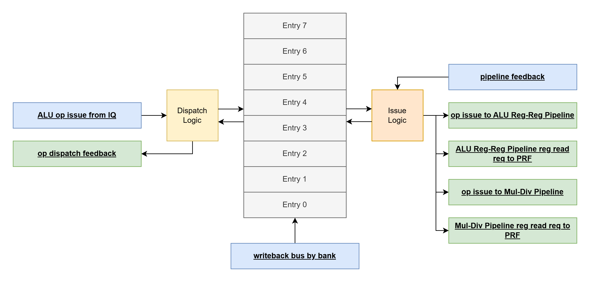

# alu_reg_md_iq
- backend issue queue for ALU Register-Register Pipeline and Mul-Div Pipeline
    - see [core_basics.md](../../basics/core_basics.md) for the basic purpose of an issue queue in the backend of the core
    - see [iq_basics.md](../../basics/iq_basics.md) for the basic function of an issue queue
- the issue queue buffers dispatched ALU Reg-Reg and Mul-Div ops in oldest-first order, waiting for each op's 2 physical register operands to be ready, independently issuing the oldest ready ALU Reg-Reg op, and the oldest ready Mul-Div op
- up to 4 ops dispatched into the issue queue per cycle from the 4-way superscalar frontend
    - see the [op dispatch by way](#op-dispatch-by-way) interface
- up to 8 ops inhabiting 8 issue queue entries can be stored in the issue queue at a time
- up to 2 issued ops per cycle
    - op: name for individual bundle of instruction info
        - an op is dispatched into the issue queue into its own valid issue queue entry
        - an op is issued into its associated pipeline from its own valid issue queue entry
    - up to 1 ALU Reg-Reg op per cycle
        - see the [op issue to ALU Reg-Reg pipeline](#op-issue-to-alu-reg-reg-pipeline) interface
    - up to 1 Mul-Div op per cycle
        - see the [op issue to Mul-Div pipeline](#op-issue-to-mul-div-pipeline) interface
    - issue involves providing the op information to the pipeline, and providing the physical register read info to the PRF
        - see [ALU Reg-Reg Pipeline reg read req to PRF](#alu-reg-reg-pipeline-reg-read-req-to-prf) for PRF reads for the ALU Reg-Reg Pipeline
        - see [Mul-Div Pipeline reg read req to PRF](#mul-div-pipeline-reg-read-req-to-prf) for PRF reads for the Mul-Div Pipeline
- the issue queue watches the writeback bus and uses dispatch info to determine when operands a not ready operand becomes ready or forwardable
    - see the [writeback bus by bank](#writeback-bus-by-bank) interface
- if the 2 operands belonging to an op are both ready or forwardable, the op is officially "ready", and is a candidate to be issued
- out of the set of ready ops associated with a given pipeline, the oldest ready op is issued to the pipeline as long as the pipeline is ready

# RTL Diagram

# Interfaces
Input interfaces blue. Output interfaces green.
These signals make more sense in combination with the information in the [Issue Queue Entry Arbitration Logic](#issue-queue-entry-arbitration-logic) section.

## seq

This is a sequential module utilizing posedge flip flops

- CLK
    - input logic
    - clock signal
- nRST
    - input logic
    - active-low asynchronous reset

## op dispatch by way

input interface

each signal is a vector, with each 1D entry out of 4 associated with a dispatch way 0-3 (hence, [3:0]). when describing the signals, language may be used to sound like a given signal has a single value, but the semantics should be replicated for all 4 vector entries associated with each of the 4 dispatch ways. 

- dispatch_attempt_by_way
    - input logic [3:0]
    - indicate intent to dispatch an ALU Reg-Reg or Mul-Div op into the IQ for each dispatch way
    - 1 flag for each of 4 ways
    - ways are expected to be ordered into the IQ from oldest/lowest way to youngest/highest way, skipping ways without a dispatch attempt as needed
        - e.g. for an empty IQ:
            - dispatch_attempt_by_way = 4'b1011
                - way 0, way 1, way 3 have a valid ALU Reg-Reg or Mul-Div op
            - entry 0 accepts way 0 dispatch
            - entry 1 accepts way 1 dispatch
            - entry 2 accepts way 3 dispatch
                - way 2 is skipped as its attempt bit is low
    - this is used so that the superscalar ways of the frontend are known to either have or not have an ALU Reg-Reg or Mul-Div op, this way the IQ can swizzle the incoming ops to the lowest open consecutive issue queue entries oldest-op-first. whether or not the front end decides to follow through with dispatching this given mask of ops will be given through dispatch_valid_alu_reg_by_way or dispatch_valid_mul_div_by_way
        - e.g. dispatch_attempt_by_way = 4'b1011, but the frontend might only want to dispatch e.g. way 0 and way 1, so (dispatch_valid_alu_reg_by_way | dispatch_valid_mul_div_by_way) == 4'b0011
        - see dispatch_valid_alu_reg_by_way for more info
    - constraints
        - for this signal and the remaining ones in this interface (besides dispatch_valid_alu_reg_by_way and dispatch_valid_mul_div_by_way), there are no constraints to which ways can have a valid op i.e. all 2^4 entries are legal
        - the only functionality difference for different ways is that the lower ways are older and should be assigned to the lower open issue queue entries, and if only e.g. 2 ops can be accepted as denoted by dispatch_ready_advertisement_by_way = 4'b0011, only the lowest 2 ways with an attempt will be dispatched
    - idle value:
        - {4{1'b0}}
- dispatch_valid_alu_reg_by_way
    - input logic [3:0]
    - indicate that this dispatched op should target the ALU Reg-Reg Pipeline
    - 1 flag for each of 4 ways
    - see dispatch_attempt_by_way for more details
    - constraints:
        - dispatch_valid_alu_reg_by_way and dispatch_valid_mul_div_by_way are mutually exclusive. one, or neither is allowed.
            - guaranteed ~(dispatch_valid_mul_div_by_way & dispatch_valid_mul_div_by_way) for each way
        - (dispatch_valid_alu_reg_by_way | dispatch_valid_mul_div_by_way) must be a subset of dispatch_attempt_by_way's high bit vector entries which can only exclude a run of the upper significant high bits
        - e.g. dispatch_attempt_by_way = 4'b1111, (dispatch_valid_alu_reg_by_way | dispatch_valid_mul_div_by_way) can be:
            - {4'b1111, 4'b0111, 4'b0011, 4'b0001, 4'b0000}
        - e.g. dispatch_attempt_by_way = 4'b1011, (dispatch_valid_alu_reg_by_way | dispatch_valid_mul_div_by_way) can be:
            - {4'b1011, 4'b0011, 4'b0001, 4'b0000}
        - e.g. dispatch_attempt_by_way = 4'b0100, (dispatch_valid_alu_reg_by_way | dispatch_valid_mul_div_by_way) can be:
            - {4'b0100, 4'b0000}
    - idle value:
        - {4{1'b0}}
- dispatch_valid_mul_div_by_way
    - input logic [3:0]
    - same semantics as dispatch_valid_alu_reg_by_way but indicate that this dispatched op should target the Mul-Div Pipeline instead
- dispatch_op_by_way
    - input logic [3:0][3:0]
    - indicate the ALU Reg-Reg / Mul-Div op
    - 4-bit op for each of 4 ways
    - the op field is shared for ALU Reg-Reg and Mul-Div, but the ops will be interpreted separately as needed when this op is issued to its associated pipeline as designated by dispatch_valid_alu_reg_by_way or dispatch_valid_mul_div_by_way
    - as far as this module is concerned, this is a pass-through to the associated pipeline
    - constraints:
        - none
    - idle value:
        - {4{4'hx}}
- dispatch_A_PR_by_way
    - input logic [3:0][6:0]
    - indicate which physical register operand A is associated with
    - 7-bit physical register for each of 4 ways
        - 128 PR's, log2(128) = 7
    - this physical register will be used to monitor the WB bus to make an operand forwardable or ready, as well as to pass 
        - the bank of interest for the operand will follow the lower 2 bits for the dispatched way 
    - constraints:
        - none
    - idle value:
        - {4{7'hx}}
- dispatch_A_ready_by_way
    - input logic [3:0]
    - indicate that operand A should enter the IQ in ready state (= 1'b1 by way) vs not ready state (= 1'b0 by way)
    - 1 flag for each of 4 ways
    - constraints:
        - none
    - idle value:
        - {4{1'bx}}
- dispatch_B_PR_by_way
    - input logic [3:0][6:0]
    - same semantics as dispatch_A_PR_by_way but for operand B
- dispatch_B_ready_by_way
    - input logic [3:0]
    - same semantics as dispatch_A_ready_by_way but for operand B
- dispatch_dest_PR_by_way
    - input logic [3:0][6:0]
    - indicate which physical register this op should write to at the end of after finishing execution in its associated pipeline
    - 7-bit physical register for each of 4 ways
        - 128 PR's, log2(128) = 7
    - as far as this module is concerned, this is a pass-through to the associated pipeline
    - constraints:
        - none
    - idle value:
        - {4{7'hx}}
- dispatch_ROB_index_by_way
    - input logic [3:0][6:0]
    - indicate which ROB index this op should mark as complete after finishing execution in its associated pipeline
    - 7-bit ROB index for each of 4 ways
        - 128 ROB entries, log2(128) = 7
    - as far as this module is concerned, this is a pass-through to the associated pipeline
    - constraints:
        - none
    - idle value:
        - {4{7'hx}}

## op dispatch feedback

output interface

- dispatch_ack_by_way
    - output logic [3:0]
    - indicate acknowledgement for each attempt in dispatch_attempt_by_way
    - 1 flag for each of 4 ways
    - acknowledgement is only possible given the beginning-of-cycle state of open IQ entries
        - i.e. if there are only 2 open IQ entries, even if 2 ops are being issued this cycle, only at most the lowest 2 dispatch attempts can be acked
        - e.g. dispatch_attempt_by_way = 4'b1101, 2 IQ entries open, dispatch_ack_by_way = 4'b0101
    - reset value:
        - 4'b0000
            - relies on dispatch_attempt_by_way = 4'b0000

## pipeline feedback

input interface

- alu_reg_pipeline_ready
    - input logic
    - indicate that the ALU Reg-Reg Pipeline is ready for issue
    - single flag
    - constraints:
        - use as control signal to stall ALU Reg-Reg Pipeline issue
    - idle value:
        - 1'b1
- mul_div_pipeline_ready
    - input logic
    - same semantics as alu_reg_pipeline_ready but for the Mul-Div Pipeline

## writeback bus by bank

input interface

- WB_bus_valid_by_bank
    - input logic [3:0]
    - indicate a WB bus event for a given PRF bank
    - 1 flag for each of 4 banks
    - constraints:
        - use as control signal to indicate WB bus event
    - idle value:
        - {4{1'b0}}
- WB_bus_upper_PR_by_bank
    - input logic [3:0][4:0]
    - indicate which upper 5 physical register bits the WB bus event corresponds to by PRF bank
    - 5 bits for each of 4 banks
        - the full physical register a writeback corresponds to can be inferred by concatenating these upper 5 bits with the 2 lower bits which can index into the 4 banks
        - when an operand watches the WB bus, it will be using the lower 2 bits previously given by dispatch_A/B_PR_by_way to identify the bank of interest and compare the upper 5 bits of this signal against the upper 5 bits previously given by dispatch_A/B_PR_by_way
    - e.g. a writeback to physical registers 0x7 and 0x11 would be represented as follows:
        - WB_bus_valid_by_bank = 4'b1010
        - WB_bus_upper_PR_by_bank = {5'h1, 5'hx, 5'h4, 5'hx}
    - constraints:
        - none
        - based on an op's operand state, it might be reliant on a certain PR WB event occurring eventually in order for the op to be issued and exit the IQ. utilize this interface accordingly to exercise the desired issue behavior
    - idle value:
        - {4{5'hx}}

## op issue to ALU Reg-Reg Pipeline

output interface

- issue_alu_reg_valid
    - output logic
    - indicate that an op is being issued to the ALU Reg-Reg Pipeline
    - single flag
    - this signal is high whenever alu_reg_pipeline_ready is high and there is an ALU Reg-Reg op currently in the IQ that is ready
        - an ALU Reg-Reg op is identifiable by dispatch_valid_alu_reg_by_way being high upon dispatch
        - op ready -> both operands in a ready or forwardable state
    - if this signal is high, the remaining signals in this interface follow the oldest ALU Reg-Reg op in the IQ
    - if this signal is low, the remaining signals in this interface are don't cares
    - reset value:
        - 1'b0
- issue_alu_reg_op
    - output logic [3:0]
    - indicate the ALU Reg-Reg op
    - 4-bit op
    - this should be a pass-through of the value given for this instruction op on dispatch in dispatch_op_by_way for the way
    - reset value:
        - 4'h0
- issue_alu_reg_A_forward
    - output logic
    - indicate to the pipeline that operand A should get its value from forwarding (and therefore does not need to perform a register read)
    - single flag
    - this signal is high if the op being issued currently has operand A in forwardable state
    - reset value:
        - 1'b0
- issue_alu_reg_A_bank
    - output logic [1:0]
    - indicate to the pipeline which bank operand A should get its data from
        - this will be used for forwarding as well as PRF register reads
    - 2-bit bank index
    - this should be a pass-through of the lower 2 bits given for this instruction op on dispatch in dispatch_A_PR_by_way
    - reset value:
        - 2'h0
- issue_alu_reg_B_forward
    - output logic
    - same semantics as issue_alu_reg_A_forward but for operand B
- issue_alu_reg_B_bank
    - output logic [1:0]
    - same semantics as issue_alu_reg_A_bank but for operand B
- issue_alu_reg_dest_PR
    - output logic [6:0]
    - indicate which physical register this op should write to at the end of after finishing execution in its associated pipeline
    - 7-bit physical register
        - 128 PR's, log2(128) = 7
    - this should be a pass-through of the PR given for this instruction op on dispatch in dispatch_dest_PR_by_way
    - reset value:
        - 7'h0
- issue_alu_reg_ROB_index
    - output logic [6:0]
    - indicate which ROB index this op should mark as complete after finishing execution in its associated pipeline
    - 7-bit ROB index
        - 128 ROB entries, log2(128) = 7
    - this should be a pass-through of the ROB index given for this instruction op on dispatch in dispatch_ROB_index_by_way
    - reset value:
        - 7'h0

## ALU Reg-Reg Pipeline reg read req to PRF

output interface

- PRF_alu_reg_req_A_valid
    - output logic
    - indicate a register read request for the PR of operand A
    - single flag
    - this should be 1 if this issued op's operand A is in the ready state
    - reset value:
        - 1'b0
- PRF_alu_reg_req_A_PR
    - output logic [6:0]
    - indicate which physical register the PR should read for operand A
    - 7-bit physical register
        - 128 PR's, log2(128) = 7
    - this should be a pass-through of the PR given for this instruction op on dispatch in dispatch_A_PR_by_way
- PRF_alu_reg_req_B_valid
    - output logic
    - same semantics as PRF_alu_reg_req_A_valid but for operand B
- PRF_alu_reg_req_B_PR
    - output logic [6:0]
    - same semantics as PRF_alu_reg_req_A_PR but for operand B

## op issue to Mul-Div Pipeline

output interface

- issue_mul_div_valid
    - output logic
    - indicate that an op is being issued to the Mul-Div Pipeline
    - single flag
    - this signal is high whenever mul_div_pipeline_ready is high and there is a Mul-Div op currently in the IQ that is ready
        - a Mul-Div op is identifiable by dispatch_valid_mul_div_by_way being high upon dispatch
        - op ready -> both operands in a ready or forwardable state
    - if this signal is high, the remaining signals in this interface follow the oldest Mul-Div op in the IQ
    - reset value:
        - 1'b0
- issue_mul_div_op
    - output logic [3:0]
    - indicate the Mul-Div op
    - 4-bit op
    - this should be a pass-through of the value given for this instruction op on dispatch in dispatch_op_by_way for the way
    - reset value:
        - 4'h0
- issue_mul_div_A_forward
    - output logic
    - indicate to the pipeline that operand A should get its value from forwarding (and therefore does not need to perform a register read)
    - single flag
    - this signal is high if the op being issued currently has operand A in forwardable state
    - reset value:
        - 1'b0
- issue_mul_div_A_bank
    - output logic [1:0]
    - indicate to the pipeline which bank operand A should get its data from
        - this will be used for forwarding as well as PRF register reads
    - 2-bit bank index
    - this should be a pass-through of the lower 2 bits given for this instruction op on dispatch in dispatch_A_PR_by_way
    - reset value:
        - 2'h0
- issue_mul_div_B_forward
    - output logic
    - same semantics as issue_mul_div_A_forward but for operand B
- issue_mul_div_B_bank
    - output logic [1:0]
    - same semantics as issue_mul_div_A_bank but for operand B
- issue_mul_div_dest_PR
    - output logic [6:0]
    - indicate which physical register this op should write to at the end of after finishing execution in its associated pipeline
    - 7-bit physical register
        - 128 PR's, log2(128) = 7
    - this should be a pass-through of the PR given for this instruction op on dispatch in dispatch_dest_PR_by_way
    - reset value:
        - 7'h0
- issue_mul_div_ROB_index
    - output logic [6:0]
    - indicate which ROB index this op should mark as complete after finishing execution in its associated pipeline
    - 7-bit ROB index
        - 128 ROB entries, log2(128) = 7
    - this should be a pass-through of the ROB index given for this instruction op on dispatch in dispatch_ROB_index_by_way
    - reset value:
        - 7'h0

## Mul-Div Pipeline reg read req to PRF

output interface

- PRF_mul_div_req_A_valid
    - output logic
    - indicate a register read request for the PR of operand A
    - single flag
    - this should be 1 if this issued op's operand A is in the ready state
    - reset value:
        - 1'b0
- PRF_mul_div_req_A_PR
    - output logic [6:0]
    - indicate which physical register the PR should read for operand A
    - 7-bit physical register
        - 128 PR's, log2(128) = 7
    - this should be a pass-through of the PR given for this instruction op on dispatch in dispatch_A_PR_by_way
- PRF_mul_div_req_B_valid
    - output logic
    - same semantics as PRF_alu_reg_req_A_valid but for operand B
- PRF_mul_div_req_B_PR
    - output logic [6:0]
    - same semantics as PRF_alu_reg_req_A_PR but for operand B

# Issue Queue Entry Arbitration Logic

- IQ entries are guaranteed by the internal logic and the external dispatch constraints as described in dispatch_attempt_by_way to always be a run of valid entries starting from lowest entry 0, followed by a run of invalid entries ending at the highest entry 7
    - either run can be empty i.e. all entries valid or all entries invalid
- IQ entries are filled via dispatches from the 4-way superscalar dispatch
- IQ entries are drained via independent single-op issues into both the ALU Reg-Reg Pipeline and the Mul-Div Pipeline, greedily issuing the oldest ready op

## Dispatch Logic
- following the [op dispatch by way](#op-dispatch-by-way) interface, greedily dispatch the lowest valid way dispatch based on the beginning-of-cycle state of the IQ entries 
    - essentially, only count the number of available IQ entries. even if there is 1 or more issues during this cycle, the entries that will open up due to this are not treated as available for dispatch on this cycle
        - effectively, entries that are opened up via issue are only made available next cycle
        - this is done so that there is not a long delay path from pipeline ready all the way back to frontend dispatch
    - in the cycle diagram, these are the arrows on the left side of the IQ entries
- when issue is eventually resolved, the existing entries and newly dispatched entries are shifted down as needed to maintain the run of valid entries, oldest to youngest from lowest entry to highest entry
    - in the cycle diagram, these are the arrows along the right side of the IQ entries

## Operand States
- "forwardable"
    - an operand is forwardable if upon dispatch, it was marked as not ready via dispatch_A/B_ready_by_way AND during this cycle, it sees a matching WB bus to the associated physical register on the [writeback bus by bank](#writeback-bus-by-bank) interface
- "ready"
    - an operand is ready if upon dispatch, it was marked as ready via dispatch_A/B_ready_by_way OR since entering the IQ, the operand was forwardable, but the op was not issued
        - an op can fail to issue on a given cycle even if an operand is ready or forwardable if its associated pipeline is not ready, it is not the oldest ready op for its associated pipeline, or the other operand for the op is not ready nor forwardable
- "not ready"
    - an operand is not ready if upon dispatch, it was marked as not ready via dispatch_A/B_ready_by_way AND since entering the IQ, has not seen and does not currently see a matching WB bus to the associated physical register on the [writeback bus by bank](#writeback-bus-by-bank) interface

## Op States
- ready
    - an op is ready if both of its operands, A AND B, are either ready or forwardable
    - a ready op is a candidate for issue to its associated pipeline
- not ready
    - an op is not ready if either of its operands, A OR B, are not ready nor forwardable 

## Issue Logic
- for the ALU Reg-Reg Pipeline, if the ALU Reg-Reg Pipeline is ready via alu_reg_pipeline_ready, the oldest ready ALU Reg-Reg op is issued from the IQ via the [op issue to ALU Reg-Reg Pipeline](#op-issue-to-alu-reg-reg-pipeline) interface and the op's register reads are sent to the PRF via the [ALU Reg-Reg Pipeline reg read req to PRF](#alu-reg-reg-pipeline-reg-read-req-to-prf) interface
- for the Mul-Div Pipeline, if the Mul-Div Pipeline is ready via mul_div_pipeline_ready, the oldest ready Mul-Div op is issued from the IQ via the [op issue to Mul-Div Pipeline](#op-issue-to-mul-div-pipeline) interface and the op's register reads are sent to the PRF via the [Mul-Div Pipeline reg read req to PRF](#mul-div-pipeline-reg-read-req-to-prf) interface
- in the cycle diagram, these are the arrows coming out to the right of the cycle diagram

# Example Operation

see [alu_reg_md_iq_example.md](alu_reg_md_iq_example.md)

# Assertions
- no output nor internal signal x's after reset
- as many or fewer valid issue's than valid dispatch's
    - or just track the ops you expect and make sure no unexpected ones occur

# Test Ideas and Coverpoints
- every op for ALU Reg-Reg, every op for Mul-Div
- there are 2^4 possible combinations of dispatch's
    - {valid, invalid} for each of 4 dispatch ways. no constraints
    - there are 3^4 combinations if differentiate {ALU Reg-Reg, Mul-Div, invalid} dispatch
    - there are many more combinations for attempted dispatches which don't end up being valid
    - there are many more combinations of possible dispatch's for each possible issue queue occupancy state. these could be targetted as well if reasonable. otherwise a good coverage of high-occupancy (e.g. 4 or fewer open entries) combinations would be desired
- there are 9^2 possible combinations of issue's
    - {no issue, entry 0, entry 1, ...} for ALU Reg-Reg and Mul-Div
- there are sum(i=0,8)2^i = 511 possible combinations of {invalid op, ALU Reg-Reg op, Mul-Div op} per issue queue entry for 8 total issue queue entries. ideally all of these are reached
    - there can be 0-8 valid entries, which must be a run of valid's starting at IQ entry 0
    - each valid entry can be ALU Reg-Reg or Mul-Div