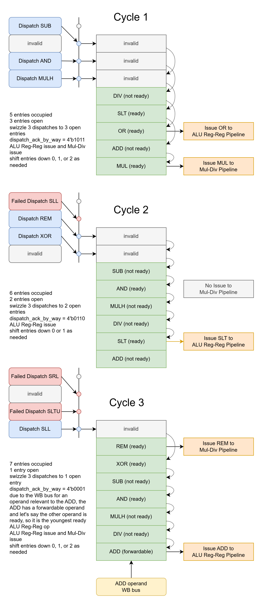

# alu_reg_md_iq Example Operation

# Key:

### op format
\<ROB index>: \<op> p\<dest PR #>, b\<operand A bank>:{r (ready), f (forwardable), n (not ready)}, b\<operand B bank>:{f,r,n}

Examples:
- 5: ADD p7, p2:n, p3:r
    - dispatch_valid_alu_reg_by_way[way] = 1
    - dispatch_valid_mul_div_by_way[way] = 0
    - dispatch_op_by_way[way] = 4'b0000
    - dispatch_A_PR_by_way[way] = 2
    - dispatch_A_ready_by_way[way] = 0
    - dispatch_B_PR_by_way[way] = 3
    - dispatch_B_ready_by_way[way] = 1
    - dispatch_dest_PR_by_way[way] = 7
    - dispatch_ROB_index_by_way[way] = 5
- 11: REM p23, p16:r, p20:f
    - dispatch_valid_alu_reg_by_way[way] = 0
    - dispatch_valid_mul_div_by_way[way] = 1
    - dispatch_op_by_way[way] = 4'b0110
    - dispatch_A_PR_by_way[way] = 16
    - dispatch_A_ready_by_way[way] = 1
    - dispatch_B_PR_by_way[way] = 20
    - dispatch_B_ready_by_way[way] = 0
        - op is now in issue queue and the current operand B state is forwardable due to p20 WB
            - WB_bus_valid_by_bank[0] = 1
            - WB_bus_upper_PR_by_bank[0] = 5'h5
            - {5'h5, 2'h0} = 7'h14 = 7'd20 -> p20 WB is happening
    - dispatch_dest_PR_by_way[way] = 23
    - dispatch_ROB_index_by_way[way] = 11

# Example Operation

