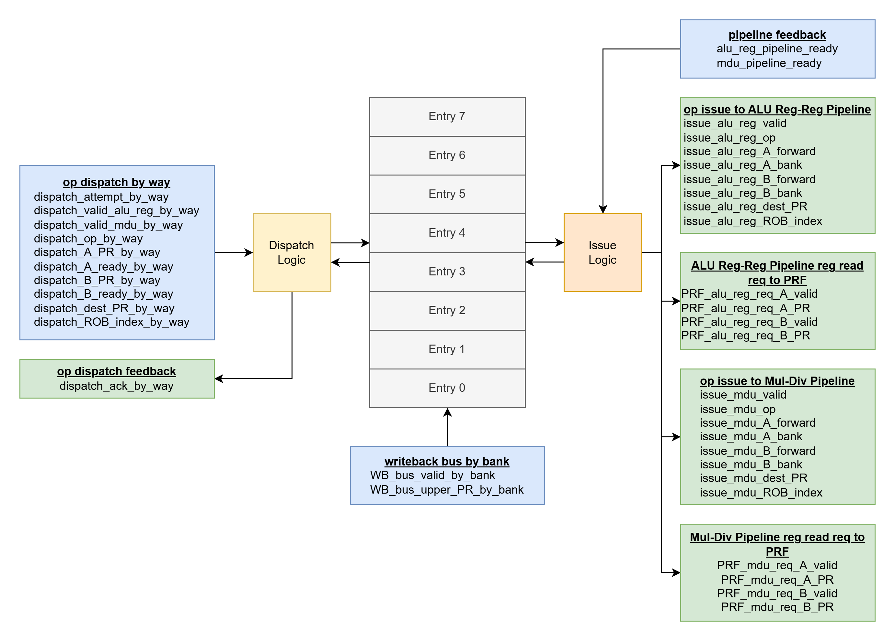

# alu_reg_mdu_iq
- backend issue queue for ALU Register-Register Pipeline and Multiplication-Division Unit Pipeline
    - see [core_basics.md](../../basics/core_basics.md) for the basic purpose of an issue queue in the backend of the core
    - see [iq_basics.md](../../basics/iq_basics.md) for the basic function of an issue queue
- example operation: [alu_reg_mdu_iq_example.md](alu_reg_mdu_iq_example.md)
- the issue queue buffers dispatched ALU Reg-Reg and MDU ops in oldest-first order, waiting for each op's 2 physical register operands to be ready, independently issuing the oldest ready ALU Reg-Reg op, and the oldest ready MDU op
- up to 4 ops dispatched into the issue queue per cycle from the 4-way superscalar frontend
    - see the [op dispatch by way](#op-dispatch-by-way) interface
- up to 8 ops inhabiting 8 issue queue entries can be stored in the issue queue at a time
- up to 2 issued ops per cycle
    - op: name for individual bundle of instruction info
        - an op is dispatched into the issue queue into its own valid issue queue entry
        - an op is issued into its associated pipeline from its own valid issue queue entry
    - up to 1 ALU Reg-Reg op per cycle
        - see the [op issue to ALU Reg-Reg pipeline](#op-issue-to-alu-reg-reg-pipeline) interface
    - up to 1 MDU op per cycle
        - see the [op issue to MDU pipeline](#op-issue-to-mul-div-pipeline) interface
    - issue involves providing the op information to the pipeline, and providing the physical register read info to the PRF
        - see [ALU Reg-Reg Pipeline reg read req to PRF](#alu-reg-reg-pipeline-reg-read-req-to-prf) for PRF reads for the ALU Reg-Reg Pipeline
        - see [MDU Pipeline reg read req to PRF](#mul-div-pipeline-reg-read-req-to-prf) for PRF reads for the MDU Pipeline
- the issue queue watches the writeback bus and uses dispatch info to determine when operands a not ready operand becomes ready or forwardable
    - see the [writeback bus by bank](#writeback-bus-by-bank) interface
- if the 2 operands belonging to an op are both ready or forwardable, the op is officially "ready", and is a candidate to be issued
- out of the set of ready ops associated with a given pipeline, the oldest ready op is issued to the pipeline as long as the pipeline is ready

# RTL Diagram

# Parameters

## Variable Parameters
The module can be customized with different values for these

Verification should be performed for the default values as given here

- ALU_REG_MDU_IQ_ENTRIES = 8
    - designate the number of IQ entries
    - design should be functional for >= 2

## Constant Parameters
All of these are constants from core_types_pkg.vh
- LOG_PR_COUNT = 7
- LOG_ROB_ENTRIES = 7
- PRF_BANK_COUNT = 4
- LOG_PRF_BANK_COUNT = 2

# Interfaces
Input interfaces blue. Output interfaces green.
These signals make more sense in combination with the information in the [Issue Queue Entry Arbitration Logic](#issue-queue-entry-arbitration-logic) section.

## seq

This is a sequential module utilizing posedge flip flops

- CLK
    - input logic
    - clock signal
- nRST
    - input logic
    - active-low asynchronous reset
    - the entire module state can be reset after a single asynchronous assertion

## op dispatch by way

input interface

each signal is a vector, with each 1D entry out of 4 associated with a dispatch way 0-3 (hence, [3:0]). when describing the signals, language may be used to sound like a given signal has a single value, but the semantics should be replicated for all 4 vector entries associated with each of the 4 dispatch ways. 

- dispatch_attempt_by_way
    - input logic [3:0]
    - indicate intent to dispatch an ALU Reg-Reg or MDU op into the IQ for each dispatch way
    - 1 flag for each of 4 ways
    - ways are expected to be ordered into the IQ from oldest/lowest way to youngest/highest way, skipping ways without a dispatch attempt as needed
        - e.g. for an empty IQ:
            - dispatch_attempt_by_way = 4'b1011
                - way 0, way 1, way 3 have a valid ALU Reg-Reg or MDU op
            - entry 0 accepts way 0 dispatch
            - entry 1 accepts way 1 dispatch
            - entry 2 accepts way 3 dispatch
                - way 2 is skipped as its attempt bit is low
        - invalid ways are skipped and valid ways are condensed as much as possible so the IQ's purpose as a buffer doesn't lead to stalls because the buffer is full when the stall could have been avoided
        - additionally, this methodology easily ensures that entry ordering follows the program order of instructions (i.e. older instructions are always in lower entries)
            - if way 2 was not skipped, and entry 2 was given way 2's invalid op, and entry 3 got way 3's valid op, then there would be an invalid entry in a string of valid entries: {0: valid, 1: valid, 2: invalid, 3:valid, 4:invalid, ...}
                - a tricky design could try to fill entry 2 with a valid op on the next cycle's dispatch, but this would violate the entry ordering following program order
                - a tricky design could have the issue queue internally condense on the cycle after they have been dispatched, but this logic would be incredibly tricky and area intensive, and even with best case functionality, it would still have a 1-cycle delay of overestimated IQ occupancy, which inherently allows for dispatch stalls, which hurts performance
    - this is used so that the superscalar ways of the frontend are known to either have or not have an ALU Reg-Reg or MDU op, this way the IQ can swizzle the incoming ops to the lowest open consecutive issue queue entries oldest-op-first. whether or not the front end decides to follow through with dispatching this given mask of ops will be given through dispatch_valid_alu_reg_by_way or dispatch_valid_mdu_by_way
        - e.g. dispatch_attempt_by_way = 4'b1011, but the frontend might only want to dispatch e.g. way 0 and way 1, so (dispatch_valid_alu_reg_by_way | dispatch_valid_mdu_by_way) == 4'b0011
        - see dispatch_valid_alu_reg_by_way for more info
    - constraints
        - for this signal and the remaining ones in this interface (besides dispatch_valid_alu_reg_by_way and dispatch_valid_mdu_by_way), there are no constraints to which ways can have a valid op i.e. all 2^4 entries are legal
        - the only functionality difference for different ways is that the lower ways are older and should be assigned to the lower open issue queue entries, and if only e.g. 2 ops can be accepted as denoted by dispatch_ready_advertisement_by_way = 4'b0011, only the lowest 2 ways with an attempt will be dispatched
    - idle value:
        - {4{1'b0}}
- dispatch_valid_alu_reg_by_way
    - input logic [3:0]
    - indicate that this dispatched op should target the ALU Reg-Reg Pipeline
    - 1 flag for each of 4 ways
    - see dispatch_attempt_by_way for more details
    - constraints:
        - dispatch_valid_alu_reg_by_way and dispatch_valid_mdu_by_way are mutually exclusive. one, or neither is allowed.
            - guaranteed ~(dispatch_valid_alu_reg_by_way[way] & dispatch_valid_mdu_by_way[way]) for each way
        - (dispatch_valid_alu_reg_by_way | dispatch_valid_mdu_by_way) must be a subset of dispatch_attempt_by_way's high bit vector entries which can only exclude a run of the upper significant high bits
        - e.g. dispatch_attempt_by_way = 4'b1111, (dispatch_valid_alu_reg_by_way | dispatch_valid_mdu_by_way) can be:
            - {4'b1111, 4'b0111, 4'b0011, 4'b0001, 4'b0000}
        - e.g. dispatch_attempt_by_way = 4'b1011, (dispatch_valid_alu_reg_by_way | dispatch_valid_mdu_by_way) can be:
            - {4'b1011, 4'b0011, 4'b0001, 4'b0000}
        - e.g. dispatch_attempt_by_way = 4'b0100, (dispatch_valid_alu_reg_by_way | dispatch_valid_mdu_by_way) can be:
            - {4'b0100, 4'b0000}
    - idle value:
        - {4{1'b0}}
- dispatch_valid_mdu_by_way
    - input logic [3:0]
    - same semantics as dispatch_valid_alu_reg_by_way but indicate that this dispatched op should target the MDU Pipeline instead
- dispatch_op_by_way
    - input logic [3:0][3:0]
    - indicate the ALU Reg-Reg / MDU op
    - 4-bit op for each of 4 ways
    - the op field is shared for ALU Reg-Reg and MDU, but the ops will be interpreted separately as needed when this op is issued to its associated pipeline as designated by dispatch_valid_alu_reg_by_way or dispatch_valid_mdu_by_way
    - as far as this module is concerned, this is a pass-through to the associated pipeline
    - constraints:
        - none
    - idle value:
        - {4{4'hx}}
- dispatch_A_PR_by_way
    - input logic [3:0][6:0]
        - design uses: input logic [3:0][LOG_PR_COUNT-1:0]
    - indicate which physical register operand A is associated with
    - 7-bit physical register for each of 4 ways
        - 128 PR's, log2(128) = 7
    - this physical register will be used to monitor the WB bus to make an operand forwardable or ready, as well as to pass 
        - the bank of interest for the operand will follow the lower 2 bits for the dispatched way 
    - constraints:
        - none
    - idle value:
        - {4{7'hx}}
- dispatch_A_ready_by_way
    - input logic [3:0]
    - indicate that operand A should enter the IQ in "ready" state (= 1'b1 by way) vs "not ready" state (= 1'b0 by way)
    - 1 flag for each of 4 ways
    - constraints:
        - none
    - idle value:
        - {4{1'bx}}
- dispatch_A_is_zero_by_way
    - input logic [3:0]
    - indicate that operand A should enter the IQ in "is zero" state (= 1'b1 by way) vs the state designated by dispatch_A_ready_by_way (= 1'b0 by way)
        - essentially, this signal by way takes precedence over dispatch_A_ready_by_way by way
    - 1 flag for each of 4 ways
    - constraints:
        - none
    - idle value:
        - {4{1'bx}}
- dispatch_B_PR_by_way
    - input logic [3:0][6:0]
        - design uses: input logic [3:0][LOG_PR_COUNT-1:0]
    - same semantics as dispatch_A_PR_by_way but for operand B
- dispatch_B_ready_by_way
    - input logic [3:0]
    - same semantics as dispatch_A_ready_by_way but for operand B
- dispatch_B_is_zero_by_way
    - input logic [3:0]
    - same semantics as dispatch_A_is_zero_by_way but for operand B
- dispatch_dest_PR_by_way
    - input logic [3:0][6:0]
        - design uses: input logic [3:0][LOG_PR_COUNT-1:0]
    - indicate which physical register this op should write to at the end of after finishing execution in its associated pipeline
    - 7-bit physical register for each of 4 ways
        - 128 PR's, log2(128) = 7
    - as far as this module is concerned, this is a pass-through to the associated pipeline
    - constraints:
        - none
    - idle value:
        - {4{7'hx}}
- dispatch_ROB_index_by_way
    - input logic [3:0][6:0]
        - design uses: input logic [3:0][LOG_ROB_ENTRIES-1:0]
    - indicate which ROB index this op should mark as complete after finishing execution in its associated pipeline
    - 7-bit ROB index for each of 4 ways
        - 128 ROB entries, log2(128) = 7
    - as far as this module is concerned, this is a pass-through to the associated pipeline
    - constraints:
        - none
    - idle value:
        - {4{7'hx}}

## op dispatch feedback

output interface

- dispatch_ack_by_way
    - output logic [3:0]
    - indicate acknowledgement for each attempt in dispatch_attempt_by_way
    - 1 flag for each of 4 ways
    - acknowledgement is only possible given the beginning-of-cycle state of open IQ entries
        - i.e. if there are only 2 open IQ entries, even if 2 ops are being issued this cycle, only at most the lowest 2 dispatch attempts can be acked
        - e.g. dispatch_attempt_by_way = 4'b1101, 2 IQ entries open, dispatch_ack_by_way = 4'b0101
    - reset value:
        - 4'b0000
            - relies on dispatch_attempt_by_way = 4'b0000

## pipeline feedback

input interface

- alu_reg_pipeline_ready
    - input logic
    - indicate that the ALU Reg-Reg Pipeline is ready for issue
    - single flag
    - constraints:
        - use as control signal to stall ALU Reg-Reg Pipeline issue
    - idle value:
        - 1'b1
- mdu_pipeline_ready
    - input logic
    - same semantics as alu_reg_pipeline_ready but for the MDU Pipeline

## writeback bus by bank

input interface

- WB_bus_valid_by_bank
    - input logic [3:0]
        - design uses: input logic [PRF_BANK_COUNT-1:0]
    - indicate a WB bus event for a given PRF bank
    - 1 flag for each of 4 banks
    - constraints:
        - use as control signal to indicate WB bus event
        - WB bus events can happen to any PR at any time. even to PR's that aren't active in the IQ. the module should appropriately ignore these and only focus on relevant PR WB events for the current entries' operands.
    - idle value:
        - {4{1'b0}}
- WB_bus_upper_PR_by_bank
    - input logic [3:0][4:0]
        - design uses: input logic [PRF_BANK_COUNT-1:0][LOG_PR_COUNT-LOG_PRF_BANK_COUNT-1:0]
    - indicate which upper 5 physical register bits the WB bus event corresponds to by PRF bank
    - 5 bits for each of 4 banks
        - the full physical register a writeback corresponds to can be inferred by concatenating these upper 5 bits with the 2 lower bits which can index into the 4 banks
        - when an operand watches the WB bus, it will be using the lower 2 bits previously given by dispatch_A/B_PR_by_way to identify the bank of interest and compare the upper 5 bits of this signal against the upper 5 bits previously given by dispatch_A/B_PR_by_way
    - e.g. a writeback to physical registers 0x7 and 0x11 would be represented as follows:
        - WB_bus_valid_by_bank = 4'b1010
        - WB_bus_upper_PR_by_bank = {5'h1, 5'hx, 5'h4, 5'hx}
    - constraints:
        - none
        - based on an op's operand state, it might be reliant on a certain PR WB event occurring eventually in order for the op to be issued and exit the IQ. utilize this interface accordingly to exercise the desired issue behavior
    - idle value:
        - {4{5'hx}}

## op issue to ALU Reg-Reg Pipeline

output interface

- issue_alu_reg_valid
    - output logic
    - indicate that an op is being issued to the ALU Reg-Reg Pipeline
    - single flag
    - this signal is high whenever alu_reg_pipeline_ready is high and there is an ALU Reg-Reg op currently in the IQ that is ready
        - an ALU Reg-Reg op is identifiable by dispatch_valid_alu_reg_by_way being high upon dispatch
        - op ready -> both operands in a ready or "forwardable" state
    - if this signal is high, the remaining signals in this interface follow the oldest ALU Reg-Reg op in the IQ
    - if this signal is low, the remaining signals in this interface are all '0
    - reset value:
        - 1'b0
- issue_alu_reg_op
    - output logic [3:0]
    - indicate the ALU Reg-Reg op
    - 4-bit op
    - this should be a pass-through of the value given for this instruction op on dispatch in dispatch_op_by_way for the way
    - reset value:
        - 4'h0
- issue_alu_reg_A_forward
    - output logic
    - indicate to the pipeline that operand A should get its value from forwarding (and therefore does not need to perform a register read)
    - single flag
    - this signal is high if the op being issued currently has operand A in "forwardable" state
    - reset value:
        - 1'b0
- issue_alu_reg_A_is_zero
    - output logic
    - indicate to the pipeline that operand A should be an internally-produced 32-bit zero (and therefore does not need to perform a register read)
    - single flag
    - this signal is high if the op being issued currently has operand A in "is zero" state
    - if this siganl is high, the following signals are don't-cares:
        - issue_alu_reg_A_forward
        - issue_alu_reg_A_bank
    - reset value:
        - 1'b0
- issue_alu_reg_A_bank
    - output logic [1:0]
        - design uses: output logic [LOG_PRF_BANK_COUNT-1:0]
    - indicate to the pipeline which bank operand A should get its data from
        - this will be used for forwarding as well as PRF register reads
    - 2-bit bank index
    - this should be a pass-through of the lower 2 bits given for this instruction op on dispatch in dispatch_A_PR_by_way
    - reset value:
        - 2'h0
- issue_alu_reg_B_forward
    - output logic
    - same semantics as issue_alu_reg_A_forward but for operand B
- issue_alu_reg_B_is_zero
    - output logic
    - same semantics as issue_alu_reg_A_is_zero but for operand B
- issue_alu_reg_B_bank
    - output logic [1:0]
        - design uses: output logic [LOG_PRF_BANK_COUNT-1:0]
    - same semantics as issue_alu_reg_A_bank but for operand B
- issue_alu_reg_dest_PR
    - output logic [6:0]
        - design uses: output logic [LOG_PR_COUNT-1:0]
    - indicate which physical register this op should write to at the end of after finishing execution in its associated pipeline
    - 7-bit physical register
        - 128 PR's, log2(128) = 7
    - this should be a pass-through of the PR given for this instruction op on dispatch in dispatch_dest_PR_by_way
    - reset value:
        - 7'h0
- issue_alu_reg_ROB_index
    - output logic [6:0]
        - design uses: output logic [LOG_ROB_ENTRIES-1:0]
    - indicate which ROB index this op should mark as complete after finishing execution in its associated pipeline
    - 7-bit ROB index
        - 128 ROB entries, log2(128) = 7
    - this should be a pass-through of the ROB index given for this instruction op on dispatch in dispatch_ROB_index_by_way
    - reset value:
        - 7'h0

## ALU Reg-Reg Pipeline reg read req to PRF

output interface

- PRF_alu_reg_req_A_valid
    - output logic
    - indicate a register read request for the PR of operand A
    - single flag
    - this should be 1 if this issued op's operand A is in the "ready" state
    - reset value:
        - 1'b0
- PRF_alu_reg_req_A_PR
    - output logic [6:0]
        - design uses: output logic [LOG_PR_COUNT-1:0]
    - indicate which physical register the PR should read for operand A
    - 7-bit physical register
        - 128 PR's, log2(128) = 7
    - this should be a pass-through of the PR given for this instruction op on dispatch in dispatch_A_PR_by_way
    - don't care if PRF_alu_reg_req_A_valid = 0
    - reset value:
        - 7'h0
- PRF_alu_reg_req_B_valid
    - output logic
    - same semantics as PRF_alu_reg_req_A_valid but for operand B
- PRF_alu_reg_req_B_PR
    - output logic [6:0]
        - design uses: output logic [LOG_PR_COUNT-1:0]
    - same semantics as PRF_alu_reg_req_A_PR but for operand B

## op issue to MDU Pipeline

output interface

- issue_mdu_valid
    - output logic
    - indicate that an op is being issued to the MDU Pipeline
    - single flag
    - this signal is high whenever mdu_pipeline_ready is high and there is a MDU op currently in the IQ that is ready
        - a MDU op is identifiable by dispatch_valid_mdu_by_way being high upon dispatch
        - op ready -> both operands in a "ready", "forwardable", or "is zero" state
    - if this signal is high, the remaining signals in this interface follow the oldest MDU op in the IQ
    - if this signal is low, the remaining signals in this interface are all '0
    - reset value:
        - 1'b0
- issue_mdu_op
    - output logic [3:0]
    - indicate the MDU op
    - 4-bit op
    - this should be a pass-through of the value given for this instruction op on dispatch in dispatch_op_by_way for the way
    - reset value:
        - 4'h0
- issue_mdu_A_forward
    - output logic
    - indicate to the pipeline that operand A should get its value from forwarding (and therefore does not need to perform a register read)
    - single flag
    - this signal is high if the op being issued currently has operand A in "forwardable" state
    - reset value:
        - 1'b0
- issue_mdu_A_is_zero
    - output logic
    - indicate to the pipeline that operand A should be an internally-produced 32-bit zero (and therefore does not need to perform a register read)
    - single flag
    - this signal is high if the op being issued currently has operand A in "is zero" state
    - if this siganl is high, the following signals are don't-cares:
        - issue_mdu_A_forward
        - issue_mdu_A_bank
    - reset value:
        - 1'b0
- issue_mdu_A_bank
    - output logic [1:0]
        - design uses: output logic [LOG_PRF_BANK_COUNT-1:0]
    - indicate to the pipeline which bank operand A should get its data from
        - this will be used for forwarding as well as PRF register reads
    - 2-bit bank index
    - this should be a pass-through of the lower 2 bits given for this instruction op on dispatch in dispatch_A_PR_by_way
    - reset value:
        - 2'h0
- issue_mdu_B_forward
    - output logic
    - same semantics as issue_mdu_A_forward but for operand B
- issue_mdu_B_is_zero
    - output logic
    - same semantics as issue_mdu_A_is_zero but for operand B
- issue_mdu_B_bank
    - output logic [1:0]
        - design uses: output logic [LOG_PRF_BANK_COUNT-1:0]
    - same semantics as issue_mdu_A_bank but for operand B
- issue_mdu_dest_PR
    - output logic [6:0]
        - design uses: output logic [LOG_PR_COUNT-1:0]
    - indicate which physical register this op should write to at the end of after finishing execution in its associated pipeline
    - 7-bit physical register
        - 128 PR's, log2(128) = 7
    - this should be a pass-through of the PR given for this instruction op on dispatch in dispatch_dest_PR_by_way
    - reset value:
        - 7'h0
- issue_mdu_ROB_index
    - output logic [6:0]
        - design uses: output logic [LOG_ROB_ENTRIES-1:0]
    - indicate which ROB index this op should mark as complete after finishing execution in its associated pipeline
    - 7-bit ROB index
        - 128 ROB entries, log2(128) = 7
    - this should be a pass-through of the ROB index given for this instruction op on dispatch in dispatch_ROB_index_by_way
    - reset value:
        - 7'h0

## MDU Pipeline reg read req to PRF

output interface

- PRF_mdu_req_A_valid
    - output logic
    - indicate a register read request for the PR of operand A
    - single flag
    - this should be 1 if this issued op's operand A is in the "ready" state
    - reset value:
        - 1'b0
- PRF_mdu_req_A_PR
    - output logic [6:0]
        - design uses: output logic [LOG_PR_COUNT-1:0]
    - indicate which physical register the PR should read for operand A
    - 7-bit physical register
        - 128 PR's, log2(128) = 7
    - this should be a pass-through of the PR given for this instruction op on dispatch in dispatch_A_PR_by_way
    - don't care if PRF_mdu_req_A_valid = 0
    - reset value:
        - 7'h0
- PRF_mdu_req_B_valid
    - output logic
    - same semantics as PRF_alu_reg_req_A_valid but for operand B
- PRF_mdu_req_B_PR
    - output logic [6:0]
        - design uses: output logic [LOG_PR_COUNT-1:0]
    - same semantics as PRF_alu_reg_req_A_PR but for operand B

# Issue Queue Entry Arbitration Logic

- IQ entries are guaranteed by the internal logic and the external dispatch constraints as described in dispatch_attempt_by_way to always be a run of valid entries starting from lowest entry 0, followed by a run of invalid entries ending at the highest entry 7
    - either run can be empty i.e. all entries valid or all entries invalid
- IQ entries are filled via dispatches from the 4-way superscalar dispatch
- IQ entries are drained via independent single-op issues into both the ALU Reg-Reg Pipeline and the MDU Pipeline, greedily issuing the oldest ready op

## Dispatch Logic
- following the [op dispatch by way](#op-dispatch-by-way) interface, greedily dispatch the lowest valid way dispatch based on the beginning-of-cycle state of the IQ entries 
    - essentially, only count the number of available IQ entries. even if there is 1 or more issues during this cycle, the entries that will open up due to this are not treated as available for dispatch on this cycle
        - effectively, entries that are opened up via issue are only made available next cycle
        - this is done so that there is not a long delay combinational path from pipeline ready all the way back to frontend dispatch
- when issue is eventually resolved, the existing entries and newly dispatched entries are shifted down as needed to maintain the run of valid entries, oldest to youngest from lowest entry to highest entry
- these properties are kind of hard to verbalize but are obvious when visualized. see [alu_reg_mdu_iq_example.md](alu_reg_mdu_iq_example.md) for a working example

## Operand States
- "is zero"
    - an operand is "is zero" if upon dispatch, it was marked as "is zero" (dispatch_A/B_is_zero_by_way[way] = 1'b1)
    - this takes priority over all other states
        - an operand enters with "is zero" state and remains "is zero" during its lifetime in the IQ
- "forwardable"
    - an operand is forwardable if upon dispatch, it was NOT marked as "is zero" (dispatch_A/B_is_zero_by_way[way] = 1'b0), AND it was marked as "not ready" (dispatch_A/B_ready_by_way[way] = 1'b0) AND during this cycle, it sees a matching WB bus to the associated physical register on the [writeback bus by bank](#writeback-bus-by-bank) interface
- "ready"
    - an operand is ready if upon dispatch, it was NOT marked as "is zero" (dispatch_A/B_is_zero_by_way[way] = 1'b0), AND it was marked as "ready" (dispatch_A/B_ready_by_way[way] = 1'b1) OR on a previous cycle since entering the IQ, the operand was marked as "forwardable", but the op was not issued
        - an op can fail to issue on a given cycle even if an operand is ready or forwardable if its associated pipeline is not ready, it is not the oldest ready op for its associated pipeline, or the other operand for the op is not ready nor forwardable
- "not ready"
    - an operand is not ready if upon dispatch, it was NOT marked as "is zero" (dispatch_A/B_is_zero_by_way[way] = 1'b0), AND it was marked as "not ready" (dispatch_A/B_ready_by_way[way] = 1'b0) AND since entering the IQ, has not seen and does not currently see a matching WB bus to the associated physical register on the [writeback bus by bank](#writeback-bus-by-bank) interface

## Op States
- ready
    - an op is ready if both of its operands, A AND B, are either "ready", "forwardable", or "is zero"
    - a ready op is a candidate for issue to its associated pipeline
- not ready
    - an op is not ready if either of its operands, A OR B, are "not ready" 

### Op State Truth Table:
This truth table enumerates all the possible combinations of operand states as achieved by different dispatch and WB bus inputs telling whether an op is a candidate to be issued and what behavior should take place if the op is not issued

| Description | dispatch_A_ready_by_way on dispatch cycle OR operand A was forwardable on previous cycle | dispatch_B_ready_by_way on dispatch cycle OR operand B was forwardable on previous cycle | dispatch_A_PR_by_way on dispatch cycle matching WB_bus_valid_by_bank + WB_bus_upper_PR_by_bank on this cycle | dispatch_B_PR_by_way on dispatch cycle matching WB_bus_valid_by_bank + WB_bus_upper_PR_by_bank on this cycle | dispatch_A_is_zero_by_way on dispatch cycle | dispatch_B_is_zero_by_way on dispatch cycle | Operand A State | Operand B State | op is ready and candidate to be issued this cycle? | Module Actions |
| :---: | :---: | :---: | :---: | :---: | :---: | :---: | :---: | :---: | :---: | :---: |
| A and B ready | 1 | 1 | 0 | 0 | 0 | 0 | ready | ready | YES | none |
| A ready, B forwardable | 1 | 0 | 0 | 1 | 0 | 0 | ready | forwardable | YES | if this op is not issued, mark B as ready |
| A forwardable, A ready | 0 | 1 | 1 | 0 | 0 | 0 | forwardable | ready | YES | if this op is not issued, mark A as ready |
| A and B forwardable | 0 | 0 | 1 | 1 | 0 | 0 | forwardable | forwardable | YES | if this op is not issued, mark A and B as ready |
| A ready, B not ready | 1 | 0 | 0 | 0 | 0 | 0 | ready | not ready | NO | none |
| A not ready, B ready | 0 | 1 | 0 | 0 | 0 | 0 | not ready | ready | NO | none |
| A forwardable, B not ready | 0 | 0 | 1 | 0 | 0 | 0 | forwardable | not ready | NO | mark operand A as ready |
| A not ready, B forwardable | 0 | 0 | 0 | 1 | 0 | 0 | not ready | forwardable | NO | mark operand B as ready |
| A not ready, B not ready | 0 | 0 | 0 | 0 | 0 | 0 | not ready | not ready | NO | none |
| A and B is zero | x | x | x | x | 1 | 1 | is zero | is zero | YES | none |
| A is zero, B ready | x | 1 | x | 0 | 1 | 0 | is zero | ready | YES | none |
| A ready, B is zero | 1 | x | 0 | x | 0 | 1 | ready | is zero | YES | none |
| A is zero, B forwardable | x | 0 | x | 1 | 1 | 0 | is zero | forwardable | YES | if this op is not issued, mark B as ready |
| A forwardable, A is zero | 0 | x | 1 | x | 0 | 1 | forwardable | is zero | YES | if this op is not issued, mark A as ready |
| A is zero, B not ready | x | 0 | x | 0 | 1 | 0 | is zero | not ready | NO | none |
| A not ready, B is zero | 0 | x | 0 | x | 0 | 1 | not ready | is zero | NO | none |

## Issue Logic
- for the ALU Reg-Reg Pipeline, if the ALU Reg-Reg Pipeline is ready via alu_reg_pipeline_ready, the oldest ready ALU Reg-Reg op is issued from the IQ via the [op issue to ALU Reg-Reg Pipeline](#op-issue-to-alu-reg-reg-pipeline) interface and the op's register reads are sent to the PRF via the [ALU Reg-Reg Pipeline reg read req to PRF](#alu-reg-reg-pipeline-reg-read-req-to-prf) interface
- for the MDU Pipeline, if the MDU Pipeline is ready via mdu_pipeline_ready, the oldest ready MDU op is issued from the IQ via the [op issue to MDU Pipeline](#op-issue-to-mul-div-pipeline) interface and the op's register reads are sent to the PRF via the [MDU Pipeline reg read req to PRF](#mul-div-pipeline-reg-read-req-to-prf) interface
- in the cycle diagram, these are the arrows coming out to the right of the cycle diagram

# Example Operation

see [alu_reg_mdu_iq_example.md](alu_reg_mdu_iq_example.md)

# Behavioral Model Ideas

### Dispatch Logic
- at beginning of cycle, check the number of empty entries: this is the maximum number of valid dispatches that can be acked
- make a list, appending in increasing way order dispatch way ops with dispatch_attempt_by_way[way] = 1'b1, stopping early if the maximum number of valid dispatches is reached
    - all of these ways should receive a dispatch_ack_by_way[way] = 1'b1
- this "dispatch list" can be concatenated to the end of the issue queue op list which is determined for the next cycle based on the ops currently in the list
    - see [Entry Logic](#entry-logic)
- the final state of the ops in the dispatch list which will enter into the issue queue can be determined by the given dispatch_valid_alu_reg_by_way[way] and dispatch_valid_mdu_by_way[way] signals
    - ALU Reg-Reg op
        - dispatch_valid_alu_reg_by_way[way] == 1'b1 && dispatch_valid_mdu_by_way[way] == 1'b0
    - MDU op
        - dispatch_valid_alu_reg_by_way[way] == 1'b0 && dispatch_valid_mdu_by_way[way] == 1'b1
    - invalid op (if want, can skip enqueueing this onto the dispatch list)
        - dispatch_valid_alu_reg_by_way[way] == 1'b0 && dispatch_valid_mdu_by_way[way] == 1'b0

### Issue Logic
- 3 passes through the issue queue entries to determine what to issue
    - logically 3 passes occur. this can obviously be optimized as desired
- first pass: determine states of operands in each entry, and consequently the readiness of the op in the entry
    - use current state and [writeback bus by bank](#writeback-bus-by-bank) interface inputs
- second pass: select ALU Reg-Reg op to issue prioritizing lowest to highest entry
    - will iterate through all entries and fail to issue if there are no ready ALU Reg-Reg ops
    - skip if alu_reg_pipeline_ready == 1'b0
- third pass: select MDU op to issue prioritizing lowest to highest entry
    - will iterate through all entries and fail to issue if there are no ready MDU ops
    - skip if mdu_pipeline_ready == 1'b0

### Entry Logic
- perform dispatch and issue modeling for this cycle first
- pop the issued ops out of the list
    - can be in the middle of the list, so ideally treat this as a linked list or python list so middle entries can be easily popped out
- concatenate the dispatch list at the end of the remaining entries
- now have the issue queue entries for next cycle

# Assertions
- no output x's after reset
- no issue without pipeline ready
    - (issue_alu_reg_valid == 1'b1) -> (alu_reg_pipeline_ready == 1'b1)
    - (issue_mdu_valid == 1'b1) -> (mdu_pipeline_ready == 1'b1)
- every issued op is associated with a dispatched op
    - issued ALU Reg-Reg op:
        - (issue_alu_reg_valid == 1'b1)
        - all other signals in [op issue to ALU Reg-Reg Pipeline](#op-issue-to-alu-reg-reg-pipeline) interface follow what expected for this op
        - signals in [ALU Reg-Reg Pipeline reg read req to PRF](#alu-reg-reg-pipeline-reg-read-req-to-prf) interface follow what expected for this op
    - dispatched ALU Reg-Reg op:
        - (dispatch_attempt_by_way[way] == 1'b1 && dispatch_valid_alu_reg_by_way[way] == 1'b1 && dispatch_valid_mdu_by_way[way] == 1'b0 && dispatch_ack_by_way[way] == 1'b1)
        - all same way associated with this same op
        - all other signals in [op dispatch by way](#op-dispatch-by-way) interface for the same way also associated with this op
    - issued MDU op:
        - (issue_mdu_valid == 1'b1)
        - all other signals in [op issue to MDU Pipeline](#op-issue-to-mdu-pipeline) interface follow what expected for this op
        - signals in [MDU Pipeline reg read req to PRF](#mdu-pipeline-reg-read-req-to-prf) interface follow what expected for this op
    - dispatched MDU op:
        - (dispatch_attempt_by_way[way] == 1'b1 && dispatch_valid_alu_reg_by_way[way] == 1'b0 && dispatch_valid_mdu_by_way[way] == 1'b1 && dispatch_ack_by_way[way] == 1'b1)
        - all same way associated with this same op
        - all other signals in [op dispatch by way](#op-dispatch-by-way) interface for the same way also associated with this op
    - num cycles with (issue_alu_reg_valid == 1'b1) + num cycles with (issue_mdu_valid == 1'b1) <= num dispatched ops
- issued op with forwarding operand means have corresponding WB bus inputs this cycle and no PRF read
    - (issue_alu_reg_valid == 1'b1 && issue_alu_reg_A_forward == 1'b1 && issue_alu_reg_A_is_zero == 1'b0) -> (WB_bus_valid_by_bank[issue_alu_reg_A_bank] == 1'b1 && PRF_alu_reg_req_A_valid == 1'b0)
        - same for operand B
        - same for operands A and B for MDU
- issued op with zero operand means have no PRF read
    - (issue_alu_reg_valid == 1'b1 && issue_alu_reg_A_is_zero == 1'b1) -> (PRF_alu_reg_req_A_valid == 1'b0)
        - same for operand B
        - same for operands A and B for MDU

# Coverpoints
- every op for ALU Reg-Reg
- every op for MDU
- every truth table case
    - see [Op State Truth Table](#op-state-truth-table)
- 2^4 possible combinations of dispatch's
    - {valid, invalid} for each of 4 dispatch ways. no constraints
    - there are 3^4 combinations if differentiate {ALU Reg-Reg, MDU, invalid} dispatch
    - there are many more combinations for attempted dispatches which don't end up being valid
    - there are many more combinations of possible dispatch's for each possible issue queue occupancy state. these could be targetted as well if reasonable. otherwise a good coverage of high-occupancy combinations would be desired (e.g. 4 or fewer open entries, essentially targetting when different dispatch_ack_by_way output can be achieved)
- 9^2 possible combinations of issue's
    - {no issue, entry 0, entry 1, ...} for ALU Reg-Reg and MDU
    - some of these are not possible as a single entry can't be issued to both pipelines
- sum(i=0,8)2^i = 511 possible combinations of {invalid op, ALU Reg-Reg op, MDU op} per issue queue entry for 8 total issue queue entries. ideally all of these are reached
    - there can be 0-8 valid entries, which must be a run of valid's starting at IQ entry 0
    - each valid entry can be ALU Reg-Reg or MDU

# Targeted Instructions

### ALU Reg-Reg
- ADD
    - dispatch_valid_alu_reg_by_way[way] = 1'b1
    - dispatch_valid_mdu_by_way[way] = 1'b0
    - dispatch_op_by_way[way] = 4'b0000
- SUB
    - dispatch_valid_alu_reg_by_way[way] = 1'b1
    - dispatch_valid_mdu_by_way[way] = 1'b0
    - dispatch_op_by_way[way] = 4'b1000
- SLL
    - dispatch_valid_alu_reg_by_way[way] = 1'b1
    - dispatch_valid_mdu_by_way[way] = 1'b0
    - dispatch_op_by_way[way] = 4'b0001
- SLT
    - dispatch_valid_alu_reg_by_way[way] = 1'b1
    - dispatch_valid_mdu_by_way[way] = 1'b0
    - dispatch_op_by_way[way] = 4'b0010
- SLTU
    - dispatch_valid_alu_reg_by_way[way] = 1'b1
    - dispatch_valid_mdu_by_way[way] = 1'b0
    - dispatch_op_by_way[way] = 4'b0011
- XOR
    - dispatch_valid_alu_reg_by_way[way] = 1'b1
    - dispatch_valid_mdu_by_way[way] = 1'b0
    - dispatch_op_by_way[way] = 4'b0100
- SRL
    - dispatch_valid_alu_reg_by_way[way] = 1'b1
    - dispatch_valid_mdu_by_way[way] = 1'b0
    - dispatch_op_by_way[way] = 4'b0101
- SRA
    - dispatch_valid_alu_reg_by_way[way] = 1'b1
    - dispatch_valid_mdu_by_way[way] = 1'b0
    - dispatch_op_by_way[way] = 4'b1101
- OR
    - dispatch_valid_alu_reg_by_way[way] = 1'b1
    - dispatch_valid_mdu_by_way[way] = 1'b0
    - dispatch_op_by_way[way] = 4'b0110
- AND
    - dispatch_valid_alu_reg_by_way[way] = 1'b1
    - dispatch_valid_mdu_by_way[way] = 1'b0
    - dispatch_op_by_way[way] = 4'b0111

### Compressed ALU Reg-Reg
- C.ADD
    - dispatch_valid_alu_reg_by_way[way] = 1'b1
    - dispatch_valid_mdu_by_way[way] = 1'b0
    - dispatch_op_by_way[way] = 4'b0000
- C.MV
    - dispatch_valid_alu_reg_by_way[way] = 1'b1
    - dispatch_valid_mdu_by_way[way] = 1'b0
    - dispatch_op_by_way[way] = 4'b0000
- C.SUB
    - dispatch_valid_alu_reg_by_way[way] = 1'b1
    - dispatch_valid_mdu_by_way[way] = 1'b0
    - dispatch_op_by_way[way] = 4'b1000
- C.XOR
    - dispatch_valid_alu_reg_by_way[way] = 1'b1
    - dispatch_valid_mdu_by_way[way] = 1'b0
    - dispatch_op_by_way[way] = 4'b0100
- C.OR
    - dispatch_valid_alu_reg_by_way[way] = 1'b1
    - dispatch_valid_mdu_by_way[way] = 1'b0
    - dispatch_op_by_way[way] = 4'b0110
- C.AND
    - dispatch_valid_alu_reg_by_way[way] = 1'b1
    - dispatch_valid_mdu_by_way[way] = 1'b0
    - dispatch_op_by_way[way] = 4'b0111

### MDU
- MUL
    - dispatch_valid_alu_reg_by_way[way] = 1'b0
    - dispatch_valid_mdu_by_way[way] = 1'b1
    - dispatch_op_by_way[way] = 4'b0000
- MULH
    - dispatch_valid_alu_reg_by_way[way] = 1'b0
    - dispatch_valid_mdu_by_way[way] = 1'b1
    - dispatch_op_by_way[way] = 4'b0001
- MULHSU
    - dispatch_valid_alu_reg_by_way[way] = 1'b0
    - dispatch_valid_mdu_by_way[way] = 1'b1
    - dispatch_op_by_way[way] = 4'b0010
- MULHU
    - dispatch_valid_alu_reg_by_way[way] = 1'b0
    - dispatch_valid_mdu_by_way[way] = 1'b1
    - dispatch_op_by_way[way] = 4'b0011
- DIV
    - dispatch_valid_alu_reg_by_way[way] = 1'b0
    - dispatch_valid_mdu_by_way[way] = 1'b1
    - dispatch_op_by_way[way] = 4'b0100
- DIVU
    - dispatch_valid_alu_reg_by_way[way] = 1'b0
    - dispatch_valid_mdu_by_way[way] = 1'b1
    - dispatch_op_by_way[way] = 4'b0101
- REM
    - dispatch_valid_alu_reg_by_way[way] = 1'b0
    - dispatch_valid_mdu_by_way[way] = 1'b1
    - dispatch_op_by_way[way] = 4'b0110
- REMU
    - dispatch_valid_alu_reg_by_way[way] = 1'b0
    - dispatch_valid_mdu_by_way[way] = 1'b1
    - dispatch_op_by_way[way] = 4'b0111