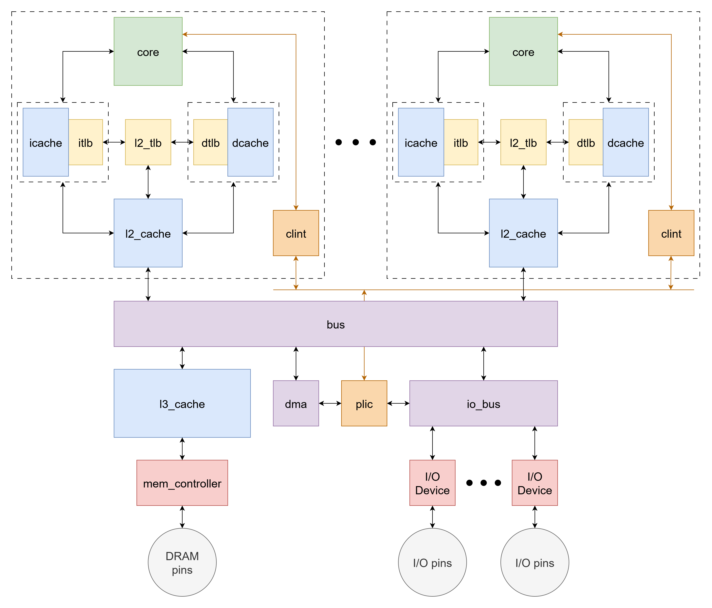

# system
- Full System-on-Chip

# Block Diagram

# Core Private Modules
Quad-Core, so 4 of each:

- Core Datapath
    - 4-way superscalar
    - out-of-order
- L1 Instruction Cache
    - 8KB
    - 2-way associative
    - 32B block
    - private, per-core
    - {valid, invalid} cache block states
- Instruction TLB
    - 32-entry
    - 2-way associative
    - private, per-core
    - {valid, invalid} page table entry states
- L1 Coherent Data Cache
    - 8KB
    - 2-way associative
    - 32B block
    - 2x bank
    - private, per-core
    - coherent
        - receives snoops from L2 Cache
    - MOESI cache block states
    - write-back
    - supports atomics
- Data TLB
    - 32-entry
    - 2-way associative
    - private, per-core
    - {valid, invalid} page table entry states
- Page Table Walker
    - unified instruction + data
    - private, per-core
    - 32-entry page table entry cache
        - doubles as L2 TLB
    - {valid, invalid} page table entry states
- L2 Cache
    - 32KB
    - 4-way associative
    - 64B block
    - unified instruction + data
    - private, per-core
    - inclusive with L1 Data Cache
    - coherent
        - receives snoops from Bus
        - snoops L1 Data Cache
    - MOESI cache block states
    - write-back

# System Modules
- Bus
    - split-transaction, pipelined
    - MOESI coherence
        - snoops L2 Caches
    - memory mapping to DRAM or I/O space
    - supports atomics
- L3 Cache
    - 256KB
    - 8-way associative
    - 64B block
    - unified instruction + data
    - shared among cores
    - {clean, dirty, invalid} cache block states
    - write-back
- Memory Controller
    - DDR3 DRAM controller
    - TBD
- DMA
    - TBD
- I/O Bus
    - blocking
    - TBD
- I/O Devices
    - TBD
- PLIC
    - Platform-Level Interrupt Controller
    - TBD
- CLINT
    - Core-Level Interrupt
    - TBD