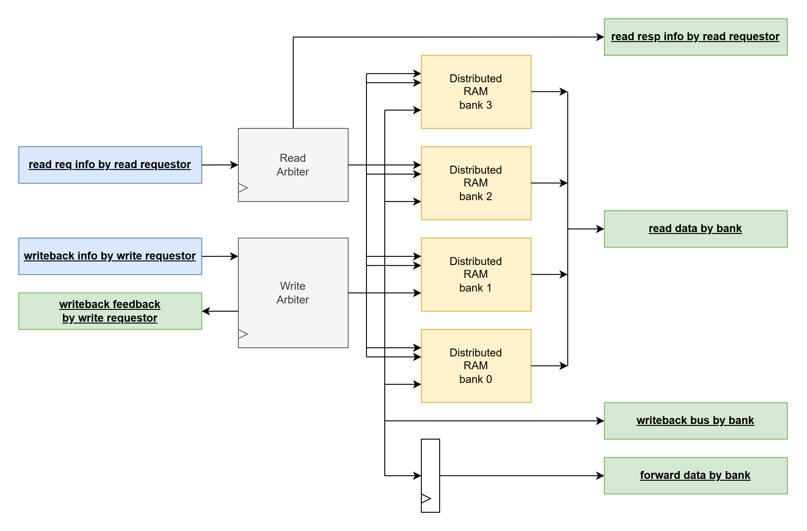

# prf
- Physical Register File
- 128x 32-bit physical registers
- 4x banks
    - 32x physical registers each
    - 2x fully-independent read ports each
    - 1x write port each
- registers are assigned to banks based on the lower 2 bits of the PR number
    - PR[1:0]
- registers are indexed within a bank based on the upper 5 bits of the PR number
    - PR[6:2]
- 11x read requestors
- 7x write requestors
- module internally arbitrates the read requests and write requests among the banks
- memory arrays are instantiated as 4x dual-read-port, single-write-port Distributed RAM arrays

# RTL Diagram

# Interfaces
Input interfaces blue. Output interfaces green.
These signals are interdependent on functionality described in [Read Arbitration](#read-arbitration) and [Write Arbitration](#write-arbitration)

## seq

This is a sequential module utilizing posedge flip flops

- CLK
    - clock signal
- nRST
    - active-low asynchronous reset

## read req info by read requestor

input interface

- read_req_valid_by_rr
    - input logic [10:0]
    - "Read Request Valid by Read Requestor"
    - bit vector signaling that a given read requestor is performing a read request
    - constraints:
        - utilize as control signal to indicate an active read request per read requestor
        - for every cycle that this signal is set for a given read requestor, the next cycle it should be set to initiate a new read request is at earliest the first cycle when the associated read_resp_ack_by_rr bit for the same read requestor is set
            - essentially, there should be only 1 active unacked read request per read requestor at a time
            - external modules guarantee this as the read requestors correspond to pipelines, and the pipelines will stall if their requests are still unacked, thus preventing issuing into the pipeline, thus preventing a new read request for this read requestor
            - else, behavior is undefined
                - in the design, the younger request will be lost. this behavior does not have to be verified
- read_req_PR_by_rr
    - input logic [10:0][6:0]
    - "Read Request Physical Register by Read Requestor"
    - vector of physical registers indicating which PR to read from for each read requestor
    - constraints:
        - none
            - any requestor can target any physical register at a given time, regardless of bank or index within a bank

## read resp info by read requestor

output interface

- read_resp_ack_by_rr
    - output logic [10:0]
    - "Read Response Acknowledgement by Read Requestor"
    - bit vector signaling that the previous read request by this read requestor is being serviced on this cycle
        - on this cycle, the read requestor is expected to sample the read_data_by_bank_by_port signal for the bank of interest (known by the read requestor) for the port of interest (indicated by read_resp_port_by_rr)
    - see [Read Arbitration](#read-arbitration) for more info
    - reset value:
        - {11{1'h0}}
- read_resp_port_by_rr
    - output logic [10:0]
    - "Read Response Port by Read Requestor"
    - vector of ports corresponding to the read requestors
    - port can be 0 or 1
    - don't care at a given bit when read_resp_ack_by_rr = 1'b0 at the associated bit
    - see [Read Arbitration](#read-arbitration) for more info
    - reset value:
        - {11{1'h0}}

## read data by bank

output interface

- read_data_by_bank_by_port
    - output logic [3:0][1:0][31:0]
    - read data for the 2 ports of each of the 4 PRF banks
    - 3D array
        - first dim: bank
        - second dim: port
        - third dim: 32'bit register data value
    - reset value:
        - {4{2{32'h0}}}

## writeback info by write requestor

input interface

- WB_valid_by_wr
    - input logic [6:0]
    - "Writeback Valid by Write Requestor"
    - bit vector signaling that a given write requestor is attempting a writeback this cycle
    - a valid writeback is ignored if WB_ready_by_wr = 1'b0 for the given write requestor
    - constraints:
        - utilize as control signal to indicate a WB attempt for each write requestor
- WB_data_by_wr
    - input logic [6:0][31:0]
    - "Writeback data by Write Requestor"
    - vector of 32-bit data to be written back for each write requestor
    - constraints:
        - none
- WB_PR_by_wr
    - input logic [6:0][6:0]
    - "Writeback Physical Registor by Write Requestor"
    - vector of physical registers indicating which PR to write back to for each write requestor
    - constraints:
        - none
- WB_ROB_index_by_wr
    - input logic [6:0][6:0]
    - "Writeback Reorder Buffer Index by Write Requestor"
    - vector of ROB indexes indicating which ROB index to mark as complete for each write requestor
    - essentially acts as a pass-through value to be assigned to complete_bus_ROB_index_by_bank when the write request is eventually completed
    - constraints:
        - none

## writeback feedback by write requestor

output interface

- WB_ready_by_wr
    - output logic [6:0]
    - "Writeback Ready by Write Requestor"
    - bit vector indicating that a new writeback request cannot be accepted this cycle for each write requestor
    - this flag directly corresponds to whether there exists an unacked/saved write request for this write requestor
    - reset value:
        - {7{1'b1}}

## writeback bus by bank

output interface

- WB_bus_valid_by_bank
    - output logic [3:0]
    - bit vector indicating whether there is a writeback this cycle for each bank
    - a writeback this cycle for a given bank also implies that on the next cycle, the data on forward_data_bus_by_bank will correspond to this cycle's writeback
    - issue queues can use this signal to check if an operand is ready and that forward data will be available next cycle
    - see [Write Arbitration](#write-arbitration) for more info
    - reset value:
        - {4{1'h0}}
- WB_bus_upper_PR_by_bank
    - output logic [3:0][4:0]
    - "Writeback Bus Upper Physical Register by Bank"
    - vector of upper 5 physical register bits for each bank
    - this is a passthrough of the upper 5 bits of the relevant write requestor of WB_PR_by_wr which was selected for this WB/complete for each bank this cycle
    - this directly translates to the memory array index that this bank is writing to
    - issue queues can check this signal to see if a writeback to a PR of interest is occurring this cycle
    - reset value:
        - {4{5'h0}}

## forward data by bank

output interface

- forward_data_bus_by_bank
    - output logic [3:0][31:0]
    - vector of 32-bit writeback data for each bank, delayed by 1 cycle
    - this signal is 1 cycle delayed behind the associated WB_bus_valid_by_bank and WB_bus_upper_PR_by_bank for this writeback
    - FU's can grab forward values from this signal if their ops were issued on the cycle before, when the FU's would have seen a WB_bus_valid_by_bank matching an operand the op was waiting for in the IQ
    - reset value:
        {4{32'h0}}

## complete bus by bank

output interface

- complete_bus_valid_by_bank
    - output logic [3:0]
    - bit vector indicating whether there is a complete notification this cycle for each bank
    - this signal coincides exactly with WB_bus_valid_by_bank and always corresponds to the same write request EXCEPT WHEN THERE IS A WRITE TO PR 0
        - in the write to PR 0 case, there will be a complete_bus_valid_by_bank = 1'b1, but WB_bus_valid_by_bank = 1'b0 as PR 0 should never be written to, but the ROB, which sees the [complete bus by bank](#complete-bus-by-bank) interface, still needs to see the completion notification for the instruction which tried to write to PR 0
    - reset value:
        - {4{1'h0}}
- complete_bus_ROB_index_by_bank
    - output logic [3:0][6:0]
    - vector of ROB indexes for each bank
    - this is essentially a pass-through of the value previously given on WB_ROB_index_by_wr
    - this is a passthrough of value given from the relevant write requestor of WB_ROB_index_by_wr which was selected for this WB/complete for each bank this cycle
    - reset value:
        - {4{7'h0}}

# Read Arbitration

Read arbitration is necessary to deal with the unideal cases where there are too many read requests with bank conflicts than can be handled by the 4x bank, 2x port read channels.

Read requests follow a blocking valid-ack paradigm, where the [read req info by read requester](#read-req-info-by-read-requestor) interface is asserted for a read requestor of interest, and then on the next cycle or until as late as the upper bound response time (6 cycles as determined below), the [read resp info by read requestor](#read-resp-info-by-read-requestor) interface is asserted. 

Subsequent read requests will be ignored during this time between a read request and a read resp ack. In the best case, fully back-to-back cycles of read requests are allowed if back-to-back 1-cycle delayed read resp acks are maintained. 

The read arbitration mechanism solves the problem of only 2 independent read ports per bank but up to 11 read requestors. Each bank follows these arbitration rules:
- 11 read requests. a read request is made up of either a current [read req info by read requester](#read-req-info-by-read-requestor) interface assertion by read requestor or a saved/unacked read request from a previous cycle when the [read req info by read requester](#read-req-info-by-read-requestor) interface was asserted by read requestor
    - following the valid-ack paradigm, a given read requestor should never try to initiate a new read request before the last one has been ack'd
        - external modules guarantee this behavior
- unacked read requests are internally saved in the prf. read response ack's are given at the beginning of the next cycle, but whether or not an unacked response needs to be saved is determined on the same cycle that [read req info by read requester](#read-req-info-by-read-requestor) interface signals arrive. 
- the age of an unacked request has no bearing on the priority of a read request. new vs. saved/previously unacked read requests are treated the same. round-robin ordering is used to guarantee older read requests eventually finish. 
- out of the set of 11 read requests at each bank:
    - port 0 follows round-robin, increasing-lsb order to select a read request if there were at least 2 read requests acked in the previous cycle, else it follows the absolute lsb-first priority
        - least significant bits in bit vectors first -> lower indexes in first
    - port 1 continues in round-robin, increasing-lsb order after port 0
        - the round-robin order for the next cycle is continued after the read request index selected by port 1
        - if there is no port 1 read request, then the round-robin is reset and absolute lsb-first priority will be used next cycle. hence the condition above where 2 read requests must be fulfilled this cycle to continue round-robin ordering next cycle (2 read requests means port 0 and port 1 were both used)
    - for either port, if there are no remaining read requests, there is no read response for the port i.e. there is no subsequent activity on the [read resp info by read requestor](#read-resp-info-by-read-requestor) and [read data by bank](#read-data-by-bank) interfaces. otherwise, the activity on these interfaces follows the selected read requests by bank by port 
- properties of read arbitration given the above rules:
    - if there is only one active read request at a bank, only port 0 will be used
    - if there are 2 or fewer read requests to a bank per cycle, there will be no stalls or unacked requests for the bank, and all read response ack's will always come on the cycle after the read requests

#### Upper Bound Response Time: 6 cycles
- 11x read requests, all to the same bank
- 10x read requests in round robin before the last request
- 2x read requests completed per cycle
- 5 cycles + 1 latched cycle

#### Arbitration Example
- I'm too lazy to do this rn as it is pretty involved. lmk if you need this.

# Write Arbitration

Write arbitration is necessary to deal with the unideal cases where there are bank conflicts to the 4x bank 1x port write channels. 

Write requests follow a ready-valid paradigm, where the [writeback info by write requestor](#writeback-info-by-write-requestor) interface is asserted for a write requestor of interest, and then on the next cycle and until as late as the upper bound response time (7 cycles as determined below), the [writeback feedback by write requestor](#writeback-feedback-by-write-requestor) interface can signal that the PRF is not ready for a new write request. 

Subsequent write requests will be ignored during this time while the [writeback feedback by write requestor](#writeback-feedback-by-write-requestor) interface is signaling not ready. In the best case, fully back-to-back cycles of write requests are allowed if the ready signal remains asserted.

The write arbitration mechanism solves the problem of only 1 write port per bank but up to 7 write requestors. Each bank follows these arbitration rules:
- 7 write requests. a write request consists of either a current [writeback info by write requestor](#writeback-info-by-write-requestor) interface assertion by write requestor or a saved/unacked write request from the last time [writeback info by write requestor](#writeback-info-by-write-requestor) was asserted and the ready signal was asserted.
    - following the ready-valid paradigm, if there is a saved/unacked write request, that is the request used for the write requestor, and the current-cycle [writeback info by write requestor](#writeback-info-by-write-requestor) interface write request is ignored, EVEN IF THIS CURRENT-CYCLE REQUEST IS TO A DIFFERENT BANK
- unacked write requests are internally saved in the prf. the ready signal is given at the beginning of the next cycle, but whether or not an unacked response needs to be saved is determined on the same cycle that [writeback info by write requestor](#writeback-info-by-write-requestor) interface signals arrive
- the age of an unacked request has no bearing on the priority of a write request. new vs. saved/previously unacked write requests are treated the same. round-robin ordering is used to guarantee older write requests eventually finish. 
- out of the set of 7 write requests at each bank:
    - follow round-robin increasing-lsb order to select a read request if there was a write request accepted in the previous cycle, else follow the absolute lsb-first priority
        - least signifciant bits in bit vector first -> lower indexes first
    - the round-robin order for the next cycle is continued after the write request index used in this cycle with a valid write request
    - if there is no write request this cycle, then the round-robin is reset and absolute lsb-first priority will be used next cycle
    - if there is no write request, there will be no subsequent activity on the [writeback bus by bank](#writeback-bus-by-bank), [forward data by bank](#forward-data-by-bank), and [complete bus by bank](#complete-bus-by-bank) interfaces. otherwise, the activity in these interfaces follows the selected write requests by bank
- properties of write arbitration given the above rules:
    - if there is only a single write request to a bank per cycle, there will be no stalls/ready deassertions or unacked requests for the bank, and all write activity will always come on the cycle after the write request

#### Upper Bound Response Time: 7 cycles
- 7x write requests, all to the same bank
- 6x write requests in round robin before the last request
- 1x write request completed per cycle
- 6 cycles + 1 latched cycle

#### Arbitration Example
- I'm too lazy to do this rn as it is pretty involved. lmk if you need this.

# Assertions
- no output nor internal signal x's after reset
- read request ack before upper bound response time
- write request ready before upper bound response time

# Test Ideas and Coverpoints
- this module is pretty tough due to the specific bank conflict arbitration rules. if it is a significant pain, specific round-robin rules don't have to be precisely tested, but instead that all bank conflicts are handled (i.e. no requests to a bank are lost) and the upper bound on response time is not surpassed
    - this could be like initiating a set of requests per bank, and expecting for one request per bank to finish per cycle, but the order in which the requests in the set are completed doesn't matter, as long as all requests are complete before the upper bound
    - read request upper bound: 6 cycles
        - 11x read requests, all to the same bank
        - 10x read requests in round robin before the last request
        - 2x read requests completed per cycle
        - 5 cycles + 1 latched cycle
    - write request upper bound: 7 cycles
        - 7x write requests, all to the same bank
        - 6x write requests in round robin before the last request
        - 1x write request completed per cycle
        - 6 cycles + 1 latched cycle
